# 弹性盒模型

## display属性

1. 如果想使用弹性盒模型，则需要给父级盒子添加display: flex或 display: inline-flex

2. flex属性值：把元素对象做为弹性伸缩盒 

3. inline-flex属性值：把元素对象做为弹性伸缩盒，且变成一个行内块级元素

4. 示例

   ```html
   <style>
       #box{
           height: 120px;
           border: 4px solid black;
           display: flex;            /*设置弹性盒子*/
           /*display: inline-flex;   !*设置弹性盒子，且把元素变成行内块级元素，且里边的子元素不会伸缩*!*/
       }
       #box .dd{
           width: 100px;
           height: 100px;
           background: red;
           font: 24px/100px 微软雅黑;
           color: white;
           text-align: center;
       }
   </style>
   <body>
       <div id="box">
           <div class="dd">1</div>
           <div class="dd">2</div>
           <div class="dd">3</div>
           <div class="dd">4</div>
           <div class="dd">5</div>
       </div>
   </body>
   ```

## 分配剩余空间（flex-grow）

1. flex-grow：根据弹性盒子元素所设置的扩展因子作为比率来分配剩余空间。 

# 历史管理

## History 对象

1. back()方法 			前往浏览器历史前一个rul ,

2. forward()方法               前往浏览器历史后一个rul ,   

3. go(index)方法              浏览器history对象 前进或者后退;   如果为负数就进入之前的url，为正就进入到之后的url，比如go(-2)表示从当前回退2次

4. length属性                    history对象中的记录数;

5. 示例

   ```html
       <body>
           <button id="btn">创建锚</button>
           <button id="btn1"><-前一个</button>
           <button id="btn2">后一个-></button>
           <input  id="num" type="number" value="1" style="width: 40px">
           <button id="btn3">前进或者后退</button>
   
           <div id="aaa">111</div>
           <div id="bbb">222</div>
           <div id="ccc">333</div>
           <div id="ddd">444</div>
       </body>
           
   <style type="text/css">
       div{
           width: 100px;
           height: 100px;
           font: 26px/100px "Agency FB";
           text-align: center;
       }
       #aaa:target{
           background: #7b7f82;
       }
       #bbb:target{
           background: #3399ff;
       }
       #ccc:target{
           background: #cc99cc;
       }
       #ddd:target{
           background: #ff9999;
       }
   </style>
   
   <script type="text/javascript">
       //length属性  history对象中的记录数;
       console.log(history.length);
   
       window.onload = function(){
           var oBtn = document.getElementById("btn");
           oBtn.onclick = function(){
               location.hash = "#ddd";   //设置或返回从井号 (#) 开始的 URL（锚）
           }
   
           var oBtn1 = document.getElementById("btn1");
           oBtn1.onclick = function(){
               history.back();           //返回到前一个url
           }
   
           var oBtn2 = document.getElementById("btn2");
           oBtn2.onclick = function(){   //返回到后一个url
               history.forward();
           }
   
           var oBtn3 = document.getElementById("btn3");
           oBtn3.onclick = function(){
               var oNum = document.querySelector("#num");
               history.go(oNum.value);
           }
       }
   </script>
   ```

## 新增pushState()方法

1. pushState()方法：可以向history历史记录里加入新的url地址，浏览器地址栏也会变成新的相对URL，但是页面并不会刷新跳转

2. pushState(state, title, url)：这此方法可以有三个参数

   * 第一个参数：是一个JS对象，可以记录要插入到历史记录条目的相关信息

   * 第二个参数：是一个可选的标题，目前暂未实现，可以写一个空串或者一个短标题

   * 第三个参数：是一个可选URL，表示当前状态栏的位置，且URL需要与当前页面在同一个域中

     ```js
     document.ondblclick = function(){
         history.pushState({"username":"H5"},"H5","history对象.html");
         // location.reload();      //重新加载刷新页面
         console.log(history);  	   //在控制台查看history对象     
     }
     ```

3. 注意pushState()方法第一个参数不支持DOM对象

## 新增replaceState() 方法

1. replaceState()方法：用法类似于pushState() ，但它仅仅是把当前页面URL替换为新URL，并不会向history对象添加新的记录

   ```js
   document.ondblclick = function(){
       history.replaceState({"username":"H5"},"H5","history对象.html")
       console.log(history);   //查看history对象
   }
   ```

## onpopstate事件

1. 触发条件：当在浏览器中点击前进或者后退时，或者调用back()，forward()，go(value)方法使用页面前进后退时 都会触发onpopstate事件

2. 注意：如果只是调用了replaceState() ，pushState()两个方法则并不会触发此事件，

   ```js
   window.onpopstate = function (ev) {
       console.log(ev.state)   //查看事件对象中的状态对象
   }
   ```

3. 因为第一个页面并没有状态，因此返回到第一个页面时，state的值为null。

# Cookie存储

## Cookie是什么

1. cookie 是存储于访问者的计算机中的变量。 
2. 每当同一台计算机通过浏览器请求某个页面时，就会发送这个 cookie。 
3. 每一组Cookie数据以键值对的形式存在，如：username="小明"
4. 我们也可以通过 JS 来创建与获取cookie数据

## Cookie的特点

1. 数量限制
   * cookie在是绑定在特定的域名下的，每个域名下的cookie数量是有限制的，不同的浏览器对这个数量的限制也不相同，一般在20-50个之间
   * 注意：如果域名下的cookie数量超出了限制，这时浏览器会删除之前设置的一个cookie来存储新cookie，所以设置cookie时要特别注意数量限制问题
2. 大小限制
   * 每一个cookie的大小也是有限制的，大约4095B左右，建议保证在4095B以内。
   * 注意：如果超出了最大限制，则cookie会被丢失
3. 访问限制
   * cookie中的数据只能让批准的接受者访问，其他的域是无法访问的
4. 发送cookie
   * 当浏览器每次发送请求时，当前的cookie数据都会包含在请求头中发送出去。
   * 注意：在很多时候我们可能并不会用到这些发送过来的cookie，所以这就会浪费带宽，特别是cookie数据比较大时。也不建议在cookie中存储大容量数据

## Cookie的作用

1. 在客户端存储数据
2. 具体案例：登陆表单记住用户名

## 设置Cookie

```js
    //设置cookie
	document.cookie = "userName=小明";
    document.cookie = "age=19";
```

## 获取Cookie

```js
    //获取cookie在控制台打印
    console.log(document.cookie);
```

## 修改Cookie

```js
    //修改cookie数据的值，就是覆盖之前设置的值，注意如果之前有在后边设置过期时间，则一样会被覆盖
    document.cookie = "userName=小红";
```

## 删除Cookie

```js
    oDate.setDate(oDate.getDate()-30);
    document.cookie = "userName=小明;expires="+oDate;	//给cookie设置一个过期时间，但这个时间是当前时间之前的时间，以此设置cookie数据的过期
    console.log(document.cookie);
```

## 谷歌客户端Cookie获取问题

1. 谷歌客户端不支持cookie的获取，如在本地直接打开页面。
2. webstorm这个工具打开页面时会临时弄一个服务器http://localhost:63342，因此它在谷歌浏览器中打开的页面可以获取到设置的cookie，因为这时相当于是在服务端进行设置

# web存储

## localStorage存储

1. 特点是没有时间限制的数据存储

2. setItem(key, value)      以键值对设置数据

   ```js
       //设置localStorage数据，注意：如果要修改数据，只要设置数据把之前的覆盖就行了
       function add(){
           localStorage.setItem("userAge",'123');
       }
   ```

3. getItem(key)                 获取数据通过名称

   ```js
       //获取数据
       function query(){
           alert(localStorage.getItem("userAge"));
       }
   ```

4. removeItem(key)         删除数据通过名称

   ```js
       //删除数据
       function remove(){
           localStorage.removeItem("userAge");
       }
   ```

5. clear()                            删除全部数据

   ```js
       //删除所有
       function removeAll(){
           localStorage.clear();
       }
   ```

6. onstorage事件

   * 注意：onstorage事件监听是其它窗口对数据的修改，就是说当在其它窗口修改了数据则会触发，在本窗口修改就不会触发

   * 事件对象上基本属性有如下：

   * key：修改或删除的key值，如果调用clear()删除，则key为null 

   * newValue： 新设置的值，如果调用removeItem()，key为null

   * oldValue：调用改变前的value值

   * storageArea : 当前的storage对象 

   * url :  触发该脚本变化的文档的url

   * 示例

     ```js
         // onstorage事件
         window.onstorage = function(ev){
             console.log(ev);
             console.log(ev.key);
             console.log(ev.newValue);
             console.log(ev.oldValue);
             console.log(ev.storageArea);
             console.log(ev.url);
         }
     ```

7. 注意事项：对于不同的网站，数据存储于不同的区域，并且一个网站只能访问其自身（区域）的数据。 

## sessionStorage存储 

1. 特点是针对一个 session 的数据存储，不是一种持久化的本地存储，仅仅是会话级别的存储 
2. sessionStorage方法与localStorage方法一样，使用方式也类似

# 多媒体

## Web 上的音/视频

1. 在如今的网络，音频和视频可以说是随处可以听到与看到，给人们的生活，学习等等提供了不少的帮助。
2. 而大多数音视频是通过插件（比如 Flash）来显示的，但是并不是所有的浏览器拥有同样的插件，所以在有的时候音视频并不能播放（或者需要下载安装插件）
3. 随着HTML5的出现，对于音视频我们也有新的处理方式

## 音频与视频编解码器

1. 音频与视频编码器是一组算法，用来对一段特定的音频与视频进行编码与解码。
2. 原始的音频与视频资源的大小一般都是比较的大的，如果不做任何处理就在网络上传输会导致传输效率很低
3. 所以一般在传输者那头会先使用编码器对音视频进行编码压缩体积，然后在接收者这头再使用解码器进行解码播放
4. 常用的音频编解码器（AAC、MPEG-3、Ogg Vorbis）
5. 常用的视频编解码器（H.264、VP8、Ogg Theora）

## HTML5音视频API

1. 音频标签audio

   * audio标签：audio 元素能够播放声音文件或者音频流。 

   * 基本使用

     ```html
     <audio src="source/求佛.mp3" controls autoplay>你的浏览器不支持此音频</audio>
     <!-- 注意：当浏览器不支持audio时，则会显示audio标签体中的内容 -->
     ```

2. 相关方法

   * canPlayType()	检测浏览器是否能播放指定的音频/视频类型

     ```js
     //检测浏览器是否能播放指定音视频类型
     var oVideo = document.createElement('video');	//创建一个video元素对象
     alert(oVideo.canPlayType('video/ogg'));			//在IE下打印空串
     alert(oVideo.canPlayType('video/mp4'));			//在IE11下打印probably
     
     //"probably" - 浏览器最可能支持该音频/视频类型
     //"maybe" - 浏览器也许支持该音频/视频类型
     //"" - （空字符串）浏览器不支持该音频/视频类型
     ```

   	 load()		        重新加载音频/视频元素

   	 play()		        开始播放音频/视频

   	 pause()		        暂停当前播放的音频/视频

3. 相关标签属性

   * autoplay	如果出现该属性，则音频在就绪后马上播放。

   	 controls	        如果出现该属性，则向用户显示控件，比如播放按钮。

   	 loop		如果出现该属性，则每当音频结束时重新开始播放。

   	 src		        要播放的音频的 URL。

   	 preload		如果出现该属性，则音频在页面加载时进行加载，并预备播放。如果使用 "autoplay"，则忽略该属性。

   * 示例

     ```html
     <audio src="source/求佛.mp3" controls autoplay loop></audio>
     ```

4. 相关属性

   * controls  				显示或隐藏用户控制界面
   * autoplay  	        媒体是否自动播放
   *  loop  		            媒体是否循环播放
   * currentTime         开始到播放现在所用的时间
   * volume                  0.0-1.0的音量相对值
   * muted  	              是否静音
   * duration                媒体总时间(只读)
   * paused                   媒体是否暂停(只读)
   * ended                     媒体是否播放完毕(只读)
   * error                       媒体发生错误的时候，返回错误代码 (只读)
   * currentSrc             以字符串的形式返回媒体地址(只读)

5. 相关事件

   * onended				当目前的播放列表已结束时
   * onpause		        当音频/视频已暂停时
   * onplay		        当音频/视频已开始或不再暂停时
   * ontimeupdate	当目前的播放位置已更改时 

6. 注意：上面提到的并不是所有的方法属性，详情请见http://www.w3school.com.cn/html5/html5_ref_audio_video_dom.asp

## HTML5视频

1. 视频标签video

   * video：HTML5 规定通过 video 元素来包含视频的标准方法。 

   * 基本使用

     ```html
     <video src="source/movie.mp4" controls width="500" height="300"></video>
     <!-- 注意：当浏览器不支持video时，则会显示video标签体中的内容 -->
     ```

2. 视频与音频API基本一致

3. 视频额外特性

   * poster属性  :     视频播放前的预览图片

     ```html
     <!-- 把视频封面设置成  美女.jpg -->
     <video src="source/movie.mp4" controls width="500" height="300" poster="source/美女.jpg"></video>
     ```

   * width、height  :     设置视频的尺寸

   * videoWidth、 videoHeight  :     视频的实际尺寸(只读) 。注：实际尺寸指的视频本身固定的帧宽高

## 视频兼容处理

1. 不同浏览器对不同的视频类型支持度不同，如在IE下暂不支持ogg类型视频文件

2. 为了让视频兼容性更好，可以使用source标签与video结合使用

3. 示例

   ```html
   <!-- 
   	把资源路径写到source标签中
   	浏览器由上而下选择资源
   	如果发现不支持类型，则会去选择下面的类型播放
   	如果支持，则会播放当前类型
   -->
   <video id="vo" controls autoplay height="500" width="300" loop poster="source/美女.jpg">
       <source src="source/movie.ogg"/>
       <source src="source/movie.mp4"/>
   </video>
   ```

# Web SQL

## Web SQL简介

1. Web SQL是什么：

   是随着HTML5规范加入的在浏览器端运行的轻量级数据库。 Web SQL是一个独立的规范

2. Web SQL的作用：

   可以把一些基本的数据保存在客户端本地，提高Web应用的性能，减轻了服务器端的负担 

3. Web SQL兼容性：

   目前Web SQL 数据库可以在最新版的 Safari, Chrome 和 Opera 浏览器中工作。 兼容性不是很好

## Web SQL核心API

1. **openDatabase**：这个方法使用现有的数据库或者新建的数据库创建一个数据库对象。
2. **transaction**：     这个方法让我们能够控制一个事务，以及基于这种情况执行提交或者回滚。
3. **executeSql**：      这个方法用于执行实际的 SQL 查询。

## 创建&&打开数据库

1. openDatabase()方法可以用来打开指定的数据库，如果指定的数据库不存在则就会创建新的数据库

2. 创建数据库

   ```js
   var mydb = openDatabase('mydb','1.0','dbTest',2*1024*1024, function () {});
   /*
   参数说明
   	第一个参数：表示创建的数据库名（必需）
   	第二个参数：表示数据库版本号（必需）
   	第三个参数：描述文本（必需）
   	第四个参数：表示大小（必需）
   	第五个参数：回调函数（可以忽略）
   */
   ```

3. 打开数据库

   ```js
   var mydb = openDatabase('mydb','1.0','dbTest',2*1024*1024);	 //如果数据库已经存在则就是获取
   ```


## 创建数据表

1. Web SQL操作与传统的数据库SQL操作差不多

2. 创建数据表示例

   ```js
   var my1 = openDatabase('mydb','1.0','dbTest',2*1024*1024);	//获取到数据库
   my1.transaction(function (tx) {
       tx.executeSql('create table if not exists users(id, username)');		//执行sql创建数据表
   })
   ```

## 插入数据

1. 示例

   ```js
   var my1 = openDatabase('mydb','1.0','dbTest',2*1024*1024);
   my1.transaction(function (tx) {
       tx.executeSql('insert into users(id, username) values(1, "小明")');
   })
   ```

2. 插入数据时，可以使用占位符，使用占位符需要注意一 一对应

   ```js
   var my1 = openDatabase('mydb','1.0','dbTest',2*1024*1024);
   var id =2 ;
   var username = "小红";
   my1.transaction(function (tx) {
       tx.executeSql('insert into users(id, username) values(?, ?)', [id, username]);	//引用外部变量
   })
   ```

## 读取数据

1. 示例

   ```js
   var my1 = openDatabase('mydb','1.0','dbTest',2*1024*1024);
   my1.transaction(function(tx){
       tx.executeSql('select * from users', [], function(tx, result){
           var rows = result.rows;		//获取数据行集合
           for (var i = 0; i < rows.length; i++) {
               console.log(rows[i]);   //在控制台打印查看第一条数据
           }
       });
   })
   ```

## 删除数据

1. 示例

   ```js
   my1.transaction(function (tx) {
       tx.executeSql('delete from users where id = 1');	//删除id等于1的那条数据
   })
   ```

2. 使用占位符删除

   ```js
   var id = 2;
   my1.transaction(function (tx) {
       tx.executeSql('delete from users where id = ?',[id]);
   })
   ```

## 修改数据 

1. 示例

   ```js
   my1.transaction(function (tx) {
       tx.executeSql('update users set username = "小小" where id = 1');
   })
   ```

2. 使用占位符修改

   ```js
   var id = 2;
   var newId = 5
   var username = "小黄"
   my1.transaction(function (tx) {
       tx.executeSql('update users set username = ?, id = ? where id = ?',[username,newId,id]);
   })
   ```

# 地理定位

## 地理定位简介

1. Geolocation API 可以允许JavaScript程序向浏览器询问用户的真实地理位置，因为这牵涉了用户的隐私，所以在获取位置之前会先询问
2. 浏览器支持情况：Internet Explorer 9、Firefox、Chrome、Safari 以及 Opera 支持地理定位。 
3. 注意：对于拥有 GPS 的设备，地理定位更加精确。 建议在手机上进行测试，在电脑上测试可能会定位失败

## 经纬度介绍


## 手机测试

1. 先用手机开个热点，用自己电脑连接上
2. 电脑需要关闭防火墙
3. 下载Xampp软件，打开安装目录下的htdocs文件夹，在里边自己创建一个目录（如：aaa），然后把自己去代码文件放进去
4. 在安装目录下找到xampp-control.exe可执行程序，点击打开界板，启动Apache服务
5. 在命令窗口运行ipconfig，查看 IPv4 地址 （如192.168.43.140）
6. 在手机上即可访问页面：192.168.43.140/aaa/index.html            默认可以省略端口
7. 如果在本地有tomcat及它的运行环境的话，使用tomcat一样可以

## WebStorm配置

1. 上面的方法可以解决手机访问电脑资源的问题。但因为每次需要把在开发工具上写好的代码文件复制到服务器中，这不方便

2. 如果开发工具是WebStorm的话，可以做如下配置

   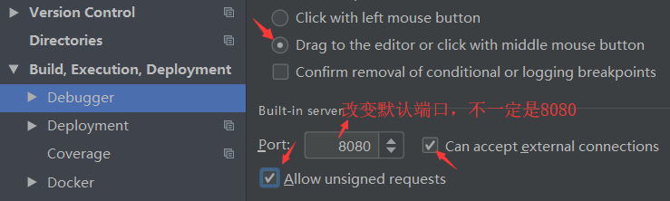

3. 在电脑本地打开的URL是这样的：localhost:8080/HTML5/地理位置/index.html

4. 在手机改变ip访问：192.168.43.140:8080/HTML5/地理位置/index.html

5. 优点：可以直接访问WebStorm工具上的代码

6. 注意：开热点，关防火墙，找IPv4 地址，这些还是一样的

## Geolocation API

# Canvas

## canvas标签

canvas 元素在页面定义一个矩形区域；可以使用使用 JavaScript 在网页上canvas区域绘制图像。

通过height，width两个标签属性设置canvas画布的大小

```html
    <style>
        #box{
            width: 900px;
            height: 600px;
            border: 1px solid black;
            margin: 100px auto;
        }
	</style>
	
	<div id="box">
		<canvas width="900" height="600">
			<span>浏览器不支持canvas</span>
		</canvas>
	</div>
```

## 绘制环境

canvas标签元素本身并没有绘制能力，需要通过canvas元素节点对象 调用 getContext() 方法返回一个对象，这个对象是一个环境对象，然后通过这个环境对象绘画

```js
    let canvasEl = document.querySelector('canvas');	// 获取canvas元素节点对象
    let context = canvasEl.getContext('2d');			// 获取到一个2d的绘画环境对象
```

## 绘制矩形

### 相关方法

1. **fillRect(x,y,w,h)：** 		   绘制一个实心矩形， 默认填充颜色为黑色
2. **strokeRect(x,y,w,h)： **   绘制一个矩形边框，  默认边框颜色为黑色，边框大小1px
3. **fillStyle：**                       填充颜色（覆盖默认色）
4. **lineWidth：**                    线宽度
5. **strokeStyle：**                 连线颜色（覆盖默认色）

```js
    let canvasEl = document.querySelector('canvas');	// 获取canvas元素节点对象
    let context = canvasEl.getContext('2d');			// 获取到一个2d的绘画环境对象

    context.fillStyle = 'red';			// 设置填充色为红色,注意fillStyle需要写在fillRect上面才会生效,可以认为是先上色,再画画
    context.fillRect(10, 10, 100, 100);	// 绘制一个实心的矩形


    context.strokeStyle = 'blue';		   // 设置边框线的颜色,strokeStyle需要写在strokeRect才会生效
    context.lineWidth = 4;				   // 设置边框线的大小为 4
    context.strokeRect(10, 120, 100, 100); // 绘制一个矩形边框
```

## 绘制路径（直线）

### 相关方法

1. **beginPath( )：**       表示开始一个新绘制路径，或重置当前的路径。

2. **closePath( )：**        表示结束绘制路径, 并且创建一条从当前点到开始点的路径

3. **moveTo(x, y)：**      移动到绘制的 新起始点

4. **lineTo(x, y)：**         要连接的新目标点

5. **storke( )：**              绘制已定义的路径。

6. **fill( )：**                    填充当前绘图（路径）默认色为黑色

   ```js
   context.beginPath();			// 开始一个新绘制路径，或重置当前的路径。
   context.moveTo(50, 50);			// 把路径移动到画布中的指定点
   context.lineTo(50, 150);		// 设置要连接的目标点
   context.lineTo(150, 150);
   context.closePath();			// 结束绘制路径, 并且创建一条从当前点到开始点的路径
   
   context.lineWidth = 20;			// 设置条线的大小（需要定在stroke绘制线条前面）
   context.strokeStyle = 'green';	// 设置条线的颜色（需要定在stroke绘制线条前面）
   context.stroke();				// 绘制已定义的路径,只有使用了stroke(),上面定义的路径线条才会显示
   context.fillStyle = 'red';		// 设置填充色
   context.fill();					// 填充当前绘图（路径），填充默认色为黑色
   
   
   context.beginPath();
   context.moveTo(200, 200);
   context.lineTo(300, 200);
   context.lineTo(250, 300);
   context.stroke();
   ```

## 绘制曲线

### 绘制圆形

1. arc() 创建**曲线**(可用于创建圆或者圆的一部分)

2. arc(x, y, 半径, 起始弧度, 结束弧度, 是否逆时针)

3. x, y 表示圆心点坐标

4. 弧度 = 角度 * Math.PI/180

5. 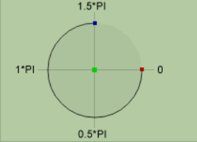 

   ```js
       // arc(x, y, 半径, 起始弧度, 结束弧度, 是否逆时针)
   	context.beginPath();
       context.arc(200, 200, 100, 0*Math.PI/180, 360*Math.PI/180, false);	// 定义一个圆形曲线
       context.arc(400, 400, 100, 0*Math.PI/180, 180*Math.PI/180, false);	// 定义一个半圆曲线
       context.stroke();
   ```

### arcTo() 绘制弧 / 曲线

1. arcTo()   在画布上创建介于两个切线之间的 弧/曲线。

2. arcTo(x1, y1, x2, y2, r);       x1, y1表示第一条切线的目标点， x2, y2表示第二条切线的目标点，r表示圆的半径

3. 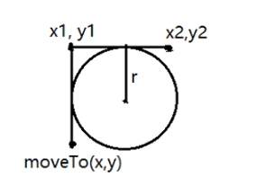 

   ```js
   context.beginPath();
   context.moveTo(0, 300);
   context.arcTo(0, 0, 300, 0, 150);	// 定义曲线
   context.stroke();					// 绘制线条
   ```

### 创建二次贝塞尔曲线

1. quadraticCurveTo(dx,dy,x1,y1) 创建一个二次贝塞尔曲线

2. dx,dy表示控制点的坐标，

3. x1,y1表示线条要连接的目标点坐标

4. 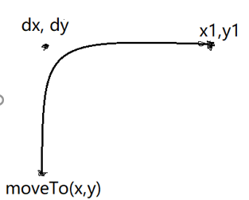 

   ```js
       // quadraticCurveTo(dx,dy,x1,y1)	创建一个二次贝塞尔曲线
       context.beginPath();
       context.moveTo(0, 300);	
       context.quadraticCurveTo(0, 0, 300, 0);	
       context.stroke();
   ```

### 创建三次贝塞尔曲线

1. bezierCurveTo(dx1,dy1, dx2,dy2,x1,x1) 创建三次贝塞尔曲线

2. dx1, dy1表示第一个控制点的坐标，dx2, dy2表示第二个控制点的坐标

3. x1,y1表示线条要连接的目标点坐标

4. 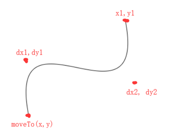 

   ```js
       // bezierCurveTo(dx1,dy1,dx2,dy2,x1,x1)	创建三次贝塞尔曲线
       context.beginPath();
       context.moveTo(0, 300);
       context.bezierCurveTo(0, 0, 300 , 300 , 300, 0);
       context.stroke();
   ```

### isPointInPath(x, y)方法

1. isPointInPath() 如果指定的点位于当前路径中，则返回 true，否则返回 false

2. 类似的方法还有isPointInStroke（x, y），判断某个点是否当前路径（线条）上

   ```js
       context.beginPath();
       context.strokeStyle = 'red';
       context.rect(0, 0, 100, 100);
       if(context.isPointInPath(50, 50)){
           context.fill();
       }
   ```

   

## Canvas转换

### translate(x,y) 偏移

1. translate(x,y)  作用是重新映射画布上的 (0,0) 位置。

   ```js
       let canvasEl = document.querySelector('canvas');	// 获取canvas元素节点对象
       let context = canvasEl.getContext('2d');			// 获取到一个2d的绘画环境对象
       context.fillRect(10, 10, 100, 100);
   
       context.translate(100, 100);						// 重置画布的初始位为100, 100
       context.fillRect(10, 10, 100, 100);					// 这里的坐标，相当之前的 110, 110
   ```

### scale(w, h) 缩放（包括定位）

1. scale(w, h)  的作用是缩放,   如果设置了scale()，则所有之后的绘图也会被缩放。定位也会被缩放

   ```js
       let canvasEl = document.querySelector('canvas');	// 获取canvas元素节点对象
       let context = canvasEl.getContext('2d');			// 获取到一个2d的绘画环境对象
   
       context.strokeRect(10, 10, 100, 100);
       context.scale(2, 2);								// 缩放
       context.strokeRect(5, 5, 100, 100);
   ```

### rotate(弧度) 旋转

1. rotate(弧度)，设置旋转，只会影响到旋转完成后的绘图

2. rotate旋转的基点是画布的0，0位置，可以通过translate(x,y) 偏移来调整

   ```js
       context.translate(200, 200);		// 把画面0，0位置重置为200，200；所以旋转的基点也是200, 200位置
       context.rotate(45*Math.PI/180);
       context.fillRect(0, 0, 100, 100);
   ```

## Canvas图像绘制

1. drawImage(img, sx, sy, swidth, sheight, x, y, width, height);	作用是可以绘制图像

2. |   *img*   |        规定要使用的图像、画布或视频。        |      |
   | :-------: | :------------------------------------------: | ---- |
   |   *sx*    |        可选。开始剪切的 x 坐标位置。         |      |
   |   *sy*    |        可选。开始剪切的 y 坐标位置。         |      |
   | *swidth*  |           可选。被剪切图像的宽度。           |      |
   | *sheight* |           可选。被剪切图像的高度。           |      |
   |    *x*    |       在画布上放置图像的 x 坐标位置。        |      |
   |    *y*    |       在画布上放置图像的 y 坐标位置。        |      |
   |  *width*  | 可选。要使用的图像的宽度（伸展或缩小图像）。 |      |
   | *height*  | 可选。要使用的图像的高度（伸展或缩小图像）。 |      |

3. 第2-5个参数作用是截取图片位置和大小，第6-9个参数作用是设置截取好的图片在画布上显示的位置与大小

   ```js
   let oImg = new Image();
   oImg.src = '../common/当月光.jpg';
   oImg.onload = () => {
       // 从图片0，0的位置开始截取300，300的大小， 然后把截取的图片绘制到画布100，100的位置，且绘制的大小为30，30
       context.drawImage(oImg, 0, 0, 300, 300, 100, 100, 30, 30);
   };
   ```

## Canvas图像平铺

1. createPattern() 默认不平铺no-repeat，
2. createPattern() 方法在指定的方向内重复指定的元素。
3. 元素可以是图片、视频，或者其他 <canvas> 元素

```js
    let oImg = new Image();
    oImg.src = '../common/当月光.jpg';
    oImg.onload = () => {
        // context.drawImage(oImg, 100, 100, 300, 300, 100, 100, 150, 150);
        let bg = context.createPattern(oImg, 'repeat-x');
        context.fillStyle = bg;
        context.fillRect(0, 0, 800, 600);
    };
```

## Canvas渐变

### 线性渐变

1. createLinearGradient(x1,y1, x2,y2),创建一个线性的渐变对象

2. 从起始点到结束点的渐变,可用于填充矩形、圆形、线条、文本

3. 通过渐变对象上的 addColorStop() 方法规定不同的颜色

4. 渐变对象需要作为 [strokeStyle](http://www.w3school.com.cn/tags/canvas_strokestyle.asp) 或 [fillStyle](http://www.w3school.com.cn/tags/canvas_fillstyle.asp) 属性的值

   ```js
       let lg = context.createLinearGradient(200, 200, 300, 300);	// 创建一个线性渐变对象
       lg.addColorStop(0, 'blue');			// 设置渐变对象中的颜色和位置
       lg.addColorStop(0.5, 'red');
       lg.addColorStop(1, 'green');
       context.fillStyle = lg;				// 以渐变做为填充颜色 
       context.fillRect(200, 200, 100, 100);
   ```

### 径向渐变

1. createRadialGradient(x1,y1,r1,  x2,y2,r2); 创建一个径向渐变对象

2. 开始圆到结束圆之间的渐变，可用于填充矩形、圆形、线条、文本等等

3. 渐变对象的 addColorStop() 方法规定不同的渐变颜色

4. 渐变对象作为 strokeStyle 或 fillStyle 属性的值

   ```js
       let rg = context.createRadialGradient(250, 250, 20, 250, 250, 30);	// 创建一个径向渐变对象
       rg.addColorStop(0, 'blue');			// 设置径向渐变对象中的颜色和位置
       rg.addColorStop(0.5, 'red');
       rg.addColorStop(0.8, 'green');
       rg.addColorStop(1, 'pink');
       context.fillStyle = rg;				// 以渐变做为填充颜色 
       context.fillRect(200, 200, 100, 100);
   ```

## Canvas文本绘制

### 填充文本

1. fillText(str, x, y)方法  在画布上绘制“被填充的”文本

2. font属性  设置或返回文本内容的当前字体属性

   ```js
   context.font = '34px 宋体';
   context.fillText('Hello Canvas', 0 , 50);
   ```

### 文本水平对齐方式

1. textAlign属性   设置或返回文本内容的当前对齐方式

2. context.textAlign = 'start';                默认，文本从指定的位置开始

3. context.textAlign = 'end';                 文本在指定的位置结束

4. context.textAlign = 'center';             文本的中心被放在指定位置

5. context.textAlign = 'left';                  文本左对齐指定位置

6. context.textAlign = 'right';               文本右对齐指定位置

   ```js
       context.font = '34px 宋体';
       context.textAlign = 'start';
       context.textAlign = 'end';
       context.textAlign = 'center';
       context.textAlign = 'left';
       context.textAlign = 'right';
       context.fillText('Hello Canvas', 0 , 50);
   ```

### 文本垂直对齐方式

1. textBaseline 设置或返回在绘制文本时使用的当前文本基线（垂直对齐）

2. context.textBaseline = 'alphabetic';         默认。文本基线是普通的字母基线。

3. context.textBaseline = 'top';                     文本基线是 em 方框的顶端。

4. context.textBaseline = 'hanging';             文本基线是悬挂基线。

5. context.textBaseline = 'middle';               文本基线是 em 方框的正中。

6. context.textBaseline = 'bottom';              文本基线是 em 方框的底端。

   ```js
   	context.font = '34px 宋体';
   	context.textBaseline = 'alphabetic';
       context.textBaseline = 'top';
       context.textBaseline = 'hanging';
       context.textBaseline = 'middle';
       context.textBaseline = 'bottom';
       context.fillText('Hello Canvas', 0 , 50);
   ```

### 文本描边

1. strokeText(str, x, y) 在画布上绘制文本（无填充）

2. measureText(str) 返回包含指定文本宽度的对象（此对象没有高度）

   ```js
       context.font = '120px 宋体';
       let text = '湖南凯舟学院';
       context.strokeText(text, 50, 100);		// 设置文本描边
       console.log(context.measureText(text).width);	// 获取到文本的宽度 
   ```

## Canvas阴影

1. context.shadowColor = 'red';			 设置或返回阴影的颜色

2. context.shadowBlur = 10;                设置或返回阴影的模糊级别

3. context.shadowOffsetX = 10;           设置或返回阴影与形状的水平距离

4. context.shadowOffsetY = 10;           设置或返回阴影与形状的垂直距离

   ```js
       context.font = '120px 宋体';
       context.shadowColor = 'red';		//  设置或返回阴影的颜色
       context.shadowBlur = 10;			//  设置或返回阴影的模糊级别
       context.shadowOffsetX = 10;			//  设置或返回阴影与形状的水平距离
       context.shadowOffsetY = 10;			//  设置或返回阴影与形状的垂直距离
       context.fillText('湖南凯舟学院', 100, 100);
       context.fillRect(300, 300, 100, 100);
   ```

## Canvas合成

### globalAlpha属性 

1. globalAlpha属性 设置或返回绘图的当前 alpha 或透明值

   ```js
       context.globalAlpha = 0.4;
       context.fillRect(100, 100, 50, 50);
   ```

### globalCompositeOperation属性

1. globalCompositeOperation 属性设置或返回新图像如何绘制到已有的图像上， 它可以有以下的值

   + source-over	默认值。在目标图像上显示源图像。
   + source-atop	在目标图像顶部显示源图像。源图像位于目标图像之外的部分是不可见的。
   + source-in	在目标图像中显示源图像。只有目标图像内的源图像部分会显示，目标图像是透明的。
   + source-out	在目标图像之外显示源图像。只会显示目标图像之外源图像部分，目标图像是透明的。
   + destination-over	在源图像上方显示目标图像。
   + destination-atop	在源图像顶部显示目标图像。源图像之外的目标图像部分不会被显示。
   + destination-in	在源图像中显示目标图像。只有源图像内的目标图像部分会被显示，源图像是透明的。
   + destination-out	在源图像外显示目标图像。只有源图像外的目标图像部分会被显示，源图像是透明的。
   + lighter	显示源图像 + 目标图像。
   + copy	显示源图像。忽略目标图像。
   + xor	使用异或操作对源图像与目标图像进行组合。

   ```js
       context.fillStyle = 'red';
       context.fillRect(0, 0, 100, 100);
       context.globalCompositeOperation = 'destination-over';	// 设置后面的图像会出现前面图像的上面
       context.fillStyle = 'blue';
       context.fillRect(50, 50, 100, 100);
   ```

   ```js
       let x = 0;
       let y = 0;
       context.globalCompositeOperation = 'copy';	// 显示源图像。忽略目标图像。 这样可以做运动
       setInterval(function(){
           context.fillStyle = 'red';
           context.fillRect(x++, y++, 100, 100);
       },100);
   ```

## Canvas图像导出

1. toDataURL()方法

2. toDataURL() 此方法是canvas元素对象的一个方法，可把canvas图像转成一个64位图像数据信息

3. 现在大多浏览器支持canvas图像导出，在canvas区域鼠标右击，则就有图片另存为的选项

   ```js
       context.fillStyle = 'red';
       context.fillRect(0, 0, 100, 100);
       let url = canvasEl.toDataURL();			// 把Canvas转换成一个base64数据
       let img = new Image();
       img.src = url;							// 设置图片的路径
       img.onload = function () {	
           document.body.appendChild(img);		// 把图片添加到页面
       }
   ```

## save() 与 restore( )

1. save( )   保存当前环境的状态。

2. restore( )  返回之前保存过的路径状态和属性。

   ```js
       context.fillStyle = 'red';
       context.save();
       context.fillStyle = "green";
       context.fillRect(10, 10, 100, 100);
   
       context.restore();
       context.fillRect(150, 75, 100, 100);
   ```

   


# SVG

# 移动端Web开发 

## 移动端Web基本知识

### 移动端浏览器

1. PC端常见浏览器：谷歌浏览器、火狐浏览器、IE浏览器、QQ浏览器、百度浏览器、搜狗浏览器、360浏览器等等
2. 移动端常见浏览器：UC浏览器，QQ浏览器，欧朋浏览器，百度手机浏览器，360安全浏览器，谷歌浏览器，搜狗手机浏览器，猎豹浏览器，以及其他杂牌浏览器。
3. 目前国内大多浏览器都是通过Webkit内核修改而来的，在移动端Web开发时主要处理Webkit内核浏览器即可

### 移动端屏幕

1. 移动端设备屏幕尺寸非常多，碎片化严重。
2. Android设备有多种分辨率：480x800, 480x854, 540x960, 720x1280，1080x1920等，还有传说中的2K，4k屏。
3. 近年来iPhone的碎片化也加剧了，其设备的主要分辨率有：640x960, 640x1136, 750x1334, 1242x2208等。
4. 作为开发者无需关注这些分辨率，因为我们常用的尺寸单位是 px 。

### 常见移动端屏幕尺寸

### 移动端调试方法

1. Chrome DevTools（谷歌浏览器）的模拟手机调试
2. 搭建本地web服务器，手机和服务器一个局域网内，通过手机访问服务器
3. 使用外网服务器，直接IP或域名访问

## 视口

视口（viewport）就是浏览器显示页面内容的屏幕区域。 视口可以分为布局视口、视觉视口和理想视口

### 布局视口 layout viewport

1. 一般移动设备的浏览器都默认设置了一个布局视口，用于解决早期的PC端页面在手机上显示的问题。

2. iOS, Android基本都将这个视口分辨率设置为 980px，所以PC上的网页大多都能在手机上呈现，只不过元素看上去很小，一般默认可以通过手动缩放网页。

   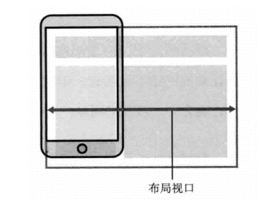 

### 视觉视口 visual viewport

1. 字面意思，它是用户正在看到的网站的区域。注意：是网站的区域。

2. 我们可以通过缩放去操作视觉视口，但不会影响布局视口，布局视口仍保持原来的宽度。

   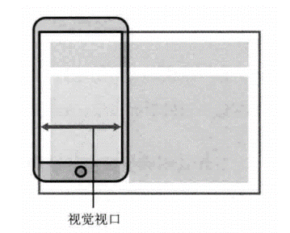 

### 理想视口 ideal viewport

1. 为了使网站在移动端有最理想的浏览和阅读宽度而设定
2. 理想视口，对设备来讲，是最理想的视口尺寸
3. 需要手动添写meta视口标签通知浏览器操作
4. meta视口标签的主要目的：布局视口的宽度应该与理想视口的宽度一致，简单理解就是设备有多宽，我们布局的视口就多宽 
5. **总结：我们开发最终会用理想视口，而理想视口就是将布局视口的宽度修改为视觉视口**

### meta标签设置理想视口

```html
<!-- 让布局视口的宽度应该与理想视口的宽度一致，设置理想视口 -->
<meta name="viewport" content="width=device-width, initial-scale=1.0,maximum-scale=1.0, minimum-scale=1.0, user-scalable=no">
```

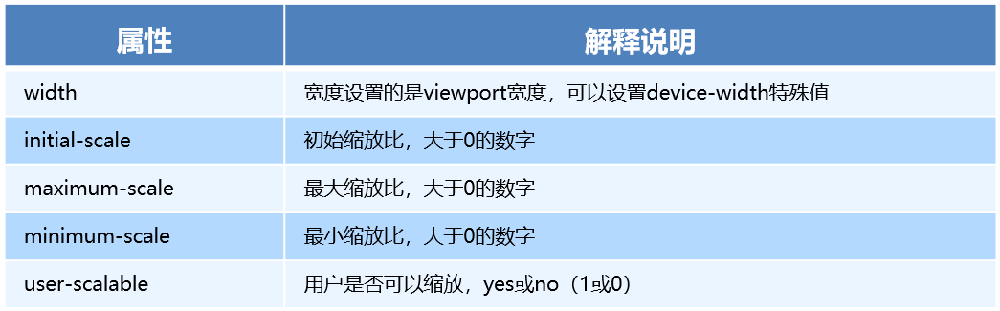 

## 物理像素、设备独立像素、设备像素比、CSS像素

1. **物理像素：**物理像素点指的是屏幕显示的最小颗粒，是物理真实存在的。这是厂商在出厂时就设置好了,  比如苹果6是 750* 1334（即分辨率）
2. **设备独立像素：**操作系统定义的一种长度单位。iphone6 的设备独立像素 375 * 667（设备实际宽高）
3. **CSS像素：**CSS 中的长度单位，在 CSS 中使用的 px 都是指 CSS 像素，在理想视口中，没有缩放的情况下，1个CSS像素 === 1个设备独立像素，CSS像素是可以被用户放大倍数的
4. **设备像素比**：物理像素 / 设备独立像素

### 视网膜屏幕

lRetina（视网膜屏幕）是一种显示技术，可以将把更多的物理像素点压缩至一块屏幕里，从而达到更高的分辨率，并提高屏幕显示的细腻程度。

比如在苹果6设备中，375 * 667的可视宽高压缩了 750* 133物理像素点；所以导致了  物理像素 / 设备独立像素 的比值 为 2

## 移动开发选择 与 技术解决方案

### 单独制作移动端页面

1. 单独制作移动端页面，PC端和移动端为两套网站，pc端是pc端的样式，移动端在写一套，专门针对移动端适配的一套网站，是两套完全不一样的样式，是一种比较主流的方案
2. 比如：京东首页

### 响应式页面兼容移动端

1. 响应式网站：即就是pc和移动端共用一套网站样式，只不过在不同屏幕下，样式会自动适配相应的样子
2. 比如：

## 移动端常见布局

### 移动端单独制作布局方式

1. 流式布局（百分比布局）
2. flex 弹性布局（推荐）
3. less+rem+媒体查询布局
4. 混合布局

### 响应式开发布局方式

1. 媒体查询
2. bootstarp

# 流式布局


1. 流式布局，就是百分比布局，也称非固定像素布局。
2. 通过盒子的宽度设置成百分比来根据屏幕的宽度来进行伸缩，不受固定像素的限制，内容向两侧填充。
3. 流式布局方式是移动web开发使用的比较常见的布局方式。


# flex 弹性布局

## 传统布局 和 flex布局对比

### 传统布局

1. 兼容性好
2. 布局繁琐
3. 局限性，不能再移动端很好的布局
4. PC端页面布局，建议使用传统布局

### flex布局

1. 操作方便，布局极其简单，移动端使用比较广泛
2. pc端浏览器支持情况比较差
3. IE11或更低版本不支持flex或仅支持部分
4. 移动端或者是不考虑兼容的pc则采用flex

## flex布局原理

+ flex 是 flexible Box 的缩写，意为"弹性布局"，用来为盒状模型提供最大的灵活性，任何一个容器都可以指定为 flex 布局。
+ 当我们为父盒子设为 flex 布局以后，子元素的 float、clear 和 vertical-align 属性将失效
+ flex布局又叫伸缩布局 、弹性布局 、伸缩盒布局 、弹性盒布局 
+ 采用 Flex 布局的元素，称为 Flex 容器（flexcontainer），简称"容器"。它的所有子元素自动成为容器成员，称为 Flex 项目（flexitem），简称"项目"。
+ **总结**：就是通过给父盒子添加flex属性，来控制子盒子的位置和排列方式

## display属性

1. 如果想使用弹性盒模型，则需要给父级盒子添加display: flex或 display: inline-flex

2. flex属性值： 把元素对象做为弹性伸缩盒 

3. inline-flex属性值： 把元素对象做为弹性伸缩盒，且变成一个行内块级元素

   ```js
   	<style>
   		#box{
   			border: 1px solid black;
   			height: 300px;
   			display: flex;
   		}
   	</style>
   	<div id="box">
   		<div style="width: 100px; height: 100px; background: red"></div>
   		<div style="width: 100px; height: 100px; background: blue"></div>
   	</div>
   ```

## 父项常见属性

### flex-direction属性

1. flex-direction属性，设置主轴的方向

2. 默认情况下，X轴（水平方向）为主轴，Y轴（垂直方向）为侧轴

3. 相关属性值

   + row   设置主轴为X轴，横向从左到右排列

   + row-reverse  设置主轴为X轴，横向从右到左排列

   + Column  设置主轴为Y轴，纵向从上往下排列顶部对齐

   + column-reverse 设置主轴为Y轴， 对齐方式与column相反

     ```js
     	<style>
             #box{
                 border: 1px solid black;
                 display: flex;
                 flex-direction: row;
             }
     	</style>
     	<div id="box">
     		<div></div>
     		<div></div>
     	</div>
     ```

### justify-content属性

1. justify-content：设置主轴上的子元素排列方式

2. 相关属性值

   + flex-start	在主轴上，向行的起始位置对齐

   + flex-end	 在主轴上，向行的结束位置对齐

   + Center		在主轴上，向行的居中位置显示 

   + Space-between	平均地分布在行里

   + space-around 	平均地分布在行里, 两侧留有空间

     ```html
     	<style>
     		#box{
     			border: 1px solid black;
     			height: 300px;
     			display: flex;
     			flex-direction: column;		/*设置主轴在Y轴上*/
     			justify-content: center;
     		}
     	</style>
     	<div id="box">
     		<div></div>
     		<div></div>
     	</div>
     ```

### flex-wrap属性

1. flex-wrap：当flex盒子(父级)宽度不够时，设置里边的子元素重新排列，作用于flex盒子，flex盒子中默认是不会换行的

2. 相关属性值

   + nowrap		flex容器为单行

   + Wrap		flex容器为多行，当flex盒子(父级)宽度不够时，子元素会排列到下一行

   + wrap-reverse	反转 wrap 排列

     ```html
     	<style>
     		#box{
     			border: 1px solid black;
     			height: 300px;
     			width: 150px;
     			display: flex;
     			flex-wrap: wrap;
     		}
     	</style>
     	<div id="box">
     		<div style="width: 100px; height: 100px; background: red"></div>
     		<div style="width: 100px; height: 100px; background: blue"></div>
     	</div>
     ```

### align-content属性

1. align-content：设置侧轴上的子元素的排列方式（多行）

2. 相关属性

   + flex-start：各行向弹性盒容器的起始位置堆叠

   + flex-end：各行向弹性盒容器的结束位置堆叠

   + center：各行向弹性盒容器的中间位置堆叠

   + space-between：各行在弹性盒容器中平均分布

   + space-around：各行在弹性盒容器中平均分布

   + stretch：各行将会伸展以占用剩余的空间（默认值）

     ```html
     	<style>
     		.box {
     			display: -webkit-flex;
     			display: flex;
     			-webkit-flex-wrap: wrap;
     			flex-wrap: wrap;
     			width: 200px;
     			height: 200px;
     			margin: 0;
     			padding: 0;
     			border-radius: 5px;
     			list-style: none;
     			background-color: #eee;
     		}
     		.box li {
     			margin: 5px;
     			padding: 10px;
     			border-radius: 5px;
     			background: #aaa;
     			text-align: center;
     		}
     		#box4 {
     			-webkit-align-content: space-between;
     			align-content: space-between;
     		}
     	</style>
     	<ul id="box4" class="box">
     		<li>a</li>
     		<li>b</li>
     		<li>c</li>
     		<li>d</li>
     		<li>e</li>
     		<li>f</li>
     	</ul>
     ```

     

### align-items属性

1. align-items：设置侧轴上的子元素排列方式（单行）

2. 相关属性

   + flex-start：从头部开始

   + flex-end：从尾部开始

   +  center：居中显示

   + stretch：拉伸（默认值）

     ```js
     	<style>
     		#box{
     			border: 1px solid black;
     			height: 300px;
     			display: flex;
     			align-items: center;
     		}
     		#box>div{
     			height: 100px;
     		}
     	</style>
     	<div id="box">
     		<div style="width: 100px; background: red"></div>
     		<div style="width: 100px; background: blue"></div>
     	</div>
     ```

### flex-flow属性

1. flex-flow：复合属性，相当于同时设置了 flex-direction 和 flex-wrap

   ```html
   	<style>
   		#box{
   			border: 1px solid black;
   			height: 300px;
   			display: flex;
   			flex-flow:column wrap-reverse;		
   		}
   	</style>
   	<div id="box">
   		<div style="width: 100px; height: 100px; background: red"></div>
   		<div style="width: 100px; height: 100px; background: blue"></div>
   	</div>
   ```

## flex布局子项常见属性

### flex-grow属性

1. 当flex父级还有剩余空间时，子元素用flex-grow来定义剩余空间扩展比率，值为数值。不允许负值 

   ```html
   	<style>
   		#box{
   			width: 800px;
   			height: 100px;
   			border: 1px solid black;
   			display: flex;
   		}
   		#box div:nth-of-type(1){
   			background: red;
   			width: 200px;
   			flex-grow: 1;
   		}
   		#box div:nth-of-type(2){
   			background: green;
   			flex-grow: 2;
   		}
   		#box div:nth-of-type(3){
   			background: blue;
   			flex-grow: 3;
   		}
   		/*
   			剩余空间=600===800-200
   			第1个div宽度 = 200 + 1/(1+2+3)*600 = 300
   			第2个div宽度 = 2/(1+2+3)*600 = 200
   			第3个div宽度 = 3/(1+2+3)*600 = 300
   		*/
   	</style>
   	
   	<div id="box">
   		<div></div>
   		<div></div>
   		<div></div>
   	</div>
   ```

### flex-shrink属性

1. 当子元素的大小总和超过flex父级时，这时根据子元素所设置的收缩因子作为比率来收缩空间，flex-shrink属性默认值为1

   ```html
   	<style>
   		#box {
   			width: 400px;
   			height: 100px;
   			border: 1px solid black;
   			display: flex;
   		}
   
   		#box div {
   			width: 200px;
   			height: 100px;
   		}
   		#box div:nth-of-type(1) {
   			background: red;
   			flex-shrink: 1;		/*这里默认的值就是为1,写不写效果是一样的*/
   		}
   		#box div:nth-of-type(2) {
   			background: black;
   			flex-shrink: 1;
   		}
   		#box div:nth-of-type(3) {
   			background: deeppink;
   			flex-shrink: 3;
   		}
   		/*
   			子级元素超过父级的空间长度为200：    400-200-200-200 = -200
   			第1个div最终长度为：200 - 1/(1+1+3)*200 == 160
   			第2个div最终长度为：200 - 1/(1+1+3)*200 == 160
   			第3个div最终长度为：200 - 3/(1+1+3)*200 == 80
   		*/
   	</style>
   	
   	<div id="box">
   		<div></div>
   		<div></div>
   		<div></div>
   	</div>
   ```

### flex-basis属性

1.   flex-basis属性设置子元素的基准值，默认为auto表示 无特定宽度值，取决于其它属性值 比如width

2. 如果所有子元素的基准值之和大于剩余空间，则会根据每项设置的基准值，按比率伸缩剩余空间 

   ```js
   	<style>
   		#box {
   			width: 400px;
   			height: 100px;
   			border: 1px solid black;
   			display: flex;
   		}
   
   		#box div {
   			height: 100px;
   		}
   		#box div:nth-of-type(1) {
   			width: 400px;			/*这里的400默认就是基准值*/
   			background: red;
   		}
   		#box div:nth-of-type(2) {
   			flex-basis: 200px;
   			background: black;
   		}
   		#box div:nth-of-type(3) {
   			flex-basis: 200px;
   			background: deeppink;
   		}
   
   		/*
   			子元素基准值超出的宽度为：(400+200+200) - 400 = 400;
   			第1个div最终宽度为：400 - 400 * 400/(400+200+200) == 200
   			第2个div最终宽度为：200 - 400 * 200/(400+200+200) == 100
   			第3个div最终宽度为：200 - 400 * 200/(400+200+200) == 100
   		*/
   	</style>
   
   	<div id="box">
   		<div></div>
   		<div></div>
   		<div></div>
   	</div>
   ```

### flex属性

1. flex属性是一个复合属性，它表示的就是 flex-grow ，flex-shrink，flex-basis三个属性的使用
2. 具体详情请查询文档

### align-self属性

1. align-self属性 控制子项自己在侧轴的排列方式，取值有flex-start、flex-end、center、baseline、stretch

2. 如果设置stretch值，表示拉伸，则子项元素可以不需要设置高度

   ```js
   	<style>
   		#box{
   			width: 800px;
   			height: 600px;
   			border: 1px solid black;
   			display: flex;
   		}
   		#box div:nth-of-type(1){
   			width: 100px;
   			height: 100px;
   			background: red;
   			align-self: center;
   		}
   	</style>
   	
   	<div id="box">
   		<div></div>
   	</div>
   ```

### order属性

1. order属性定义子项的排列顺序（前后顺序）、更多详情请查询文档

   ```html
   	<style>
   		#box {
   			width: 800px;
   			border: 1px solid black;
   			display: flex;
   		}
   		#box div:nth-of-type(1){
   			width: 100px;
   			height: 100px;
   			background: red;
   			order: 2;
   		}
   		#box div:nth-of-type(2){
   			width: 100px;
   			height: 100px;
   			background: orange;
   			order: -1;
   		}
   	</style>
   	
   	<div id="box">
   		<div></div>
   		<div></div>
   	</div>
   ```

## flex布局页面案例

### 携程网

1. https://m.ctrip.com/html5/

# rem、less、媒体查询

## rem

### em

1. em是一个单位

2. 1em的大小 等于 父级元素的字体大小

   ```html
   	<style>
   		div{
   			font-size: 14px;
   		}
   		p{
   			width: 10em;		/*这里的值是 10*14 == 140px*/
   			height: 10em;
   			background: red;
   		}
   	</style>
   	
   	<div><p></p></div>
   ```

### rem

1. rem（root em） 表示的意思是，根元素html元素的倍数

2. 1rem 等于 html元素的字体大小

3. rem的优势在于，在页面中父级元素文字大小可能不一致， 但是整个页面只有一个html，可以很好来控制整个页面的元素大小。

   ```html
   	<style>
   		html{font-size: 20px}
   		div{font-size: 14px;}
   		p{
   			width: 10em;		/*这里的值是 10*14 == 140px*/
   			height: 10rem;		/*这里的值是 10*20 == 200px*/
   			background: red;
   		}
   	</style>
   
   	<div><p></p></div>
   ```

## 媒体查询

媒体查询（Media Query）是CSS3新语法

使用 @media查询，可以针对不同的媒体类型定义不同的样式

@media 可以针对不同的屏幕尺寸设置不同的样式

当重置浏览器大小的过程中，页面也会根据浏览器的宽度和高度重新渲染页面 

目前针对很多苹果手机、Android手机，平板等设备都用得到多媒体查询

### 语法

1. @media  mediatype  and|not|only  (media feature) {  CSS代码;  }      注意中间的空格不能少

2. @media 注意前面一定要有一个@

3. mediatype表示设备类型，将不同的终端设备划分成不同的类型，称为媒体类型（设备类型）；比如 **screen** 表示用于计算机显示器、 **print** 表示用于打印机、**all** 表示用于所有媒体设备类型

4. and|not|only 表示逻辑条件，and表示并且、not表示非 用于排除某个媒体类型、only表示指定某个特定的媒体类型

5. (media feature) 表示媒体特性，可以理解为是一个具体条件，可以写width表示设备页面可见区宽度、min-width表示设备页面可见区最小宽度、max-width表示设备页面可见区小大宽度

6. 示例1

   ```html
   	<style>
   		/*表示计算机显示器 并且 屏幕宽度小于800时；注意最大宽度800另一层意思就是 宽度小于800*/
   		@media screen and (max-width: 800px){
   			body{
   				background: gold;
   			}
   		}
   		/*表示计算机显示器 并且 屏幕宽度大于1200时；注意最小宽度1200另一层意思就是 宽度大于1200*/
   		@media screen and (min-width: 1200px){
   			body{
   				background: pink;
   			}
   		}
   	</style>
   ```

7. 示例2

   ```html
   	<style>
   		@media screen and (max-width: 599px){		/*设备宽度小于599时 为brown色*/
   			body{
   				background: brown;
   			}
   		}
   		@media screen and (min-width: 600px) {		/*设备宽度大于600px时 为pink色*/
   			body{
   				background: pink;
   			}
   		}
   		@media screen and (min-width: 1500px){		/*设备宽度大于1500时 为purple色*/
   			body{
   				background: purple;
   			}
   		}
   	</style>
   ```

## less

### CSS的弊端

1. CSS 是一门非程序式语言，没有变量、函数、SCOPE（作用域）等概念。
2. CSS 需要书写大量看似没有逻辑的代码，CSS 冗余度是比较高的。
3. 不方便维护及扩展，不利于复用。
4. CSS 没有很好的计算能力
5. 非前端开发工程师来讲，往往会因为缺少 CSS 编写经验而很难写出组织良好且易于维护的 CSS 代码项目

### Less 介绍

1. Less（LeanerStyle Sheets 的缩写）是一门 CSS扩展语言，也是CSS的一个预处理器
2. Less是一门 CSS 预处理语言，它扩展了CSS的动态特性。
3. 做为 CSS的一种形式的扩展，它并没有减少CSS的功能，而是在现有的CSS语法上，为CSS加入程序式语言的特性
4. 它在CSS 的语法基础之上，引入了变量，Mixin（混入），运算以及函数等功能，大大简化了 CSS 的编写，并且降低了 CSS的维护成本，就像它的名称所说的那样，Less可以让我们用更少的代码做更多的事情
5. Less中文网址：http://lesscss.cn/
6. 常见的CSS预处理器：Sass、Less、Stylus

### Less 安装

1. 需要先安装nodeJS，nodeJS下载网址，网址：http://nodejs.cn/download/，跟平时安装软件一样，一直下一步就行，最后安装
2. 检查是否安装成功，使用cmd命令（win10是window+r 打开运行输入cmd） ---输入“node –v”查看版本即可
3. 在cmd命令窗口中 运行 “npm install -g less”  即可，这样就成功基于nodejs在线安装了Less，
4. 检查LESS是否安装成功，使用cmd命令“ lessc -v ”查看版本即可

### webstorm less 转换 css

1. 虽然后less编写时很方便，但是我们的html页面中的需要引入的最终还是CSS文件，所以需要我们把写好的less文件转换成CSS文件

2. 在webstorm中做如下设置就行

   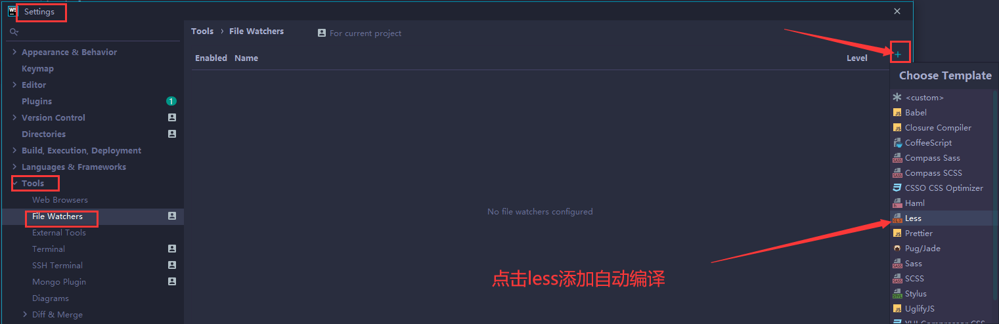 

   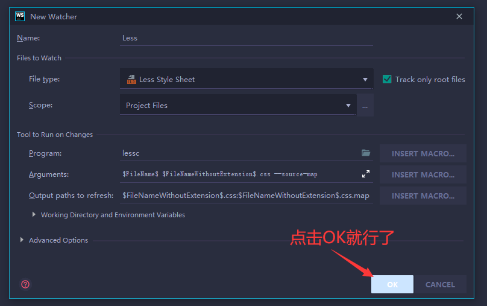 

3. 效果

   ​	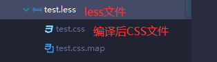 

### Less变量

1. 语法：@变量名: 值；

2. 变量命名规则：

   + 必须有@为前缀
   + 不能包含特殊字符
   + 不能以数字开头
   + 大小写敏感

   ```less
   /*Less文件*/
   @bgColor: pink;		// 定义一个变量
   @w: 50px;
   body{
     width: @w;		// 使用变量值
     background: @bgColor;
   }
   
   /*less编译后的CSS文件*/
   body {
     width: 50px;
     background: pink;
   }
   ```

3. 使用变量的好处就在于，修改一个变量，就可以改变所有引入变量的地方

### less嵌套

```less
/*LESS文件代码*/
@bgColor: pink;
@w: 50px;
#box {						// #box元素下的子元素  直接嵌套写在 #box{}下面
  background: @bgColor;
  font-size: @w;

  p {   // box下的后代p元素
    color: blue;
  }

  &>p{  // box下的子代p元素，注意&这个符号
    color: red;
  }

  &:hover {   // 给box添加hover伪类
    background: palevioletred;
  }

  &::after{   // 给box添加after伪类对象
    content: "我是box下的一个after伪类";
  }
}


/*编译后的CSS文件代码*/
#box {
  background: pink;
  font-size: 50px;
}
#box p {
  color: blue;
}
#box > p {
  color: red;
}
#box:hover {
  background: palevioletred;
}
#box::after {
  content: "我是box下的一个after伪类";
}
```

### less 运算

Less提供了加（+）、减（-）、乘（*）、除（/）算术运算。任何数字、颜色或者变量都可以参与运算

1. 运算符中间左右有个空格隔开 1px + 10

2. 对于两个不同的单位的值之间的运算，运算结果的值取第一个值的单位

3. 如果两个值之间只有一个值有单位，则运算结果就取该单位

   ```less
   @bgColor: pink;
   @w: 50px;
   body {
     width: 1rem * @w; // 对于两个不同的单位的值之间的运算，运算结果的值取第一个值的单位
     height: 2*@w; // 如果两个值之间只有一个值有单位，则运算结果就取该单位
     border: (@w+10)/6 solid black;
   }
   ```

## rem适配第二种方案

1. 在前面我们使用less、rem、媒体查询时，我们需要写很多的媒体查询去适配不同的屏幕，比较繁琐；为了解决这个繁琐的问题，我们可以使用 flexible.js

2. flexible.js  是由手机淘宝团队写的一个简洁高效 移动端适配库，里边通过JS代码给我们做了不同屏幕的媒体查询，所以就不需要我们再去写媒体查询适配了

3. 要注意的是  flexible.js 会当前设备划分为10等份；比如750的设计屏宽，则1rem ===  75px; 

4. flexible.js 的 github地址：https://github.com/amfe/lib-flexible

5. flexible.js默认会把整个屏幕宽分为10等分，比如现在我们希望最大页面宽度就是750px，则1rem===75px；但如果实际页面宽为1000px，就会1rem===100px了，

   这个时候我们可以通过提升样式优先级来解决这个问题

   ```css
   <style>
       /*当屏宽大于750px时候*/
       @media screen and (min-width: 750px){
           html{
               /*设置根元素html的font-size===75px; !important表示此样式为最高优先级*/
               font-size: 75px !important;
           }
       }
   </style>
   ```

### webstorm中的px2rwd插件

1. 在我们写页面时，需要常常把px转换成rem单位。比如750的设计屏宽，根元素html的 font-size: 75px;， 则75px===1rem；150px===2rem等等

2. px2rwd插件就可以帮助我们快速的把px单位 转换 成rem

3. 安装px2rwd插件

   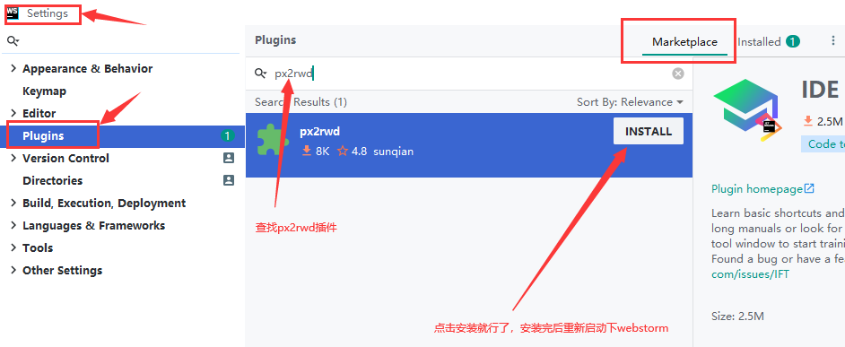 

   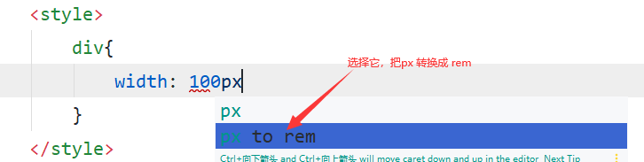 

4. **修改px2rwd插件  1rem的大小**

   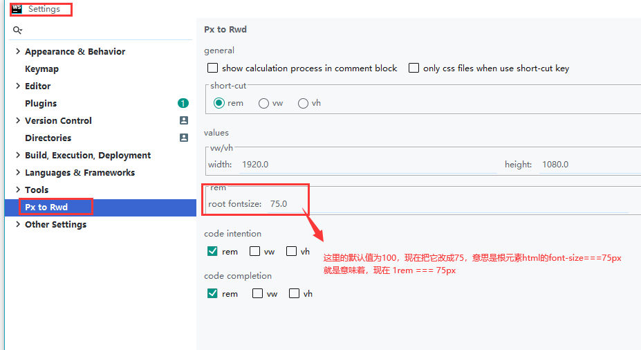 

### 总结：

这里的rem第二种适配方案，其实原理与前面的 less、rem、媒体查询是一样的；只是使用flexible.js的这种方式，使用起来更加的简单些

# 响应式布局

## 响应式布局简介

响应式布局是Ethan Marcotte在2010年5月份提出的一个概念，简单的来说，就是一个网站能够兼容多个终端——而不是为每个终端做一个特定的版本。

使用了响应式布局的相关网站

https://www.bootcss.com/						

https://segmentfault.com/		思否

https://www.microsoft.com/zh-cn

http://www.daqianduan.com/

## 响应式布局简单使用

当屏幕大于768时 ，效果如下

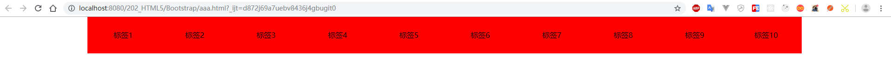

当屏幕小于768时，效果如下

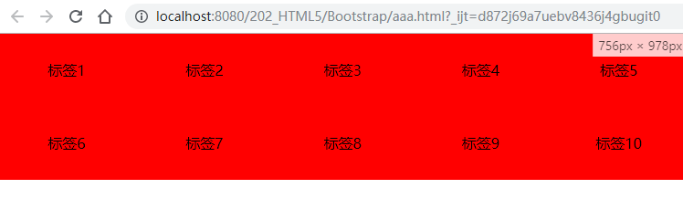 

**代码如下：**

```html
	<style>
		*{margin: 0;padding: 0}
		ul,li{list-style: none}
		#box{
			width: 80%;
			margin: 0 auto;
		}
		#box ul::after{content: ""; display:block; clear: both;}
		#box ul li{
			float: left;
			height: 80px;
			text-align: center;
			line-height: 80px;
			width: 10%;
			background: red;
		}
		@media screen and (max-width: 768px){	/*通过媒体查询，对页面元素进行布局修改地，以达到我们想要的结果*/
			#box{
				width: 100%;
			}
			#box ul li{
				width: 20%;
			}
		}
	</style>

	<div id="box">
		<ul>
			<li>标签1</li>
			<li>标签2</li>
			<li>标签3</li>
			<li>标签4</li>
			<li>标签5</li>
			<li>标签6</li>
			<li>标签7</li>
			<li>标签8</li>
			<li>标签9</li>
			<li>标签10</li>
		</ul>
	</div>
```

## Bootstrap

Bootstrap，来自 Twitter，是目前最受欢迎的前端框架之一。

Bootstrap 是基于 HTML、CSS、JAVASCRIPT 的，它简洁灵活，使得 Web 开发更加快捷，特别是它的所提供的栅格系统，可以让我们快速的写出响应式布局的页面。

Bootstrap是一个框架：顾名思义就是一套架构，它有一套比较完整的网页功能解决方案，而且控制权在框架本身，有预制样式库、组件和插件。使用者要按照框架所规定的某种规范进行开发。

额外知识：Twitter，俗称推特，美国社交网络及微博客服务的网站，是全球互联网上访问量最大的十个网站之一

## Bootstrap优点

+ 标准化的html+css编码规范
+ 提供了一套简洁、直观、强悍的组件
+  有自己的生态圈，不断的更新迭代
+ 让开发更简单，提高了开发的效率

## Bootstrap版本简介

2.x.x：停止维护,兼容性好,代码不够简洁，功能不够完善。
3.x.x：目前使用最多,稳定,但是放弃了IE6-IE7。对 IE8 支持但是界面效果不好,偏向用于开发响应式布局、移动设备优先的WEB 项目。
4.x.x：最新版，目前还不是很流行

官方网点：https://www.bootcss.com/

## Bootstrap基本使用

### 1、下载Bootstrap

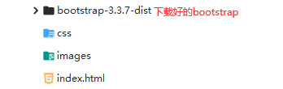     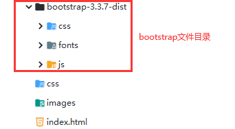 

### 2、创建一个Bootstrap基本页面模板

https://v3.bootcss.com/getting-started/#template

```html
<!DOCTYPE html>
<html lang="zh-CN">
  <head>
    <meta charset="utf-8">
    <meta http-equiv="X-UA-Compatible" content="IE=edge">
    <meta name="viewport" content="width=device-width, initial-scale=1">
    <!-- 上述3个meta标签*必须*放在最前面，任何其他内容都*必须*跟随其后！ -->
    <title>Bootstrap 101 Template</title>

    <!-- Bootstrap核心样式文件 -->
    <link href="https://cdn.jsdelivr.net/npm/bootstrap@3.3.7/dist/css/bootstrap.min.css" rel="stylesheet">

    <!-- HTML5 shim 和 Respond.js 是为了让 IE8 支持 HTML5 元素和媒体查询（media queries）功能 -->
    <!-- 警告：通过 file:// 协议（就是直接将 html 页面拖拽到浏览器中）访问页面时 Respond.js 不起作用 -->
    <!--[if lt IE 9]>
      <script src="https://cdn.jsdelivr.net/npm/html5shiv@3.7.3/dist/html5shiv.min.js"></script>
      <script src="https://cdn.jsdelivr.net/npm/respond.js@1.4.2/dest/respond.min.js"></script>
    <![endif]-->
  </head>
  <body>
    <h1>你好，世界！</h1>

    <!-- jQuery (Bootstrap 的所有 JavaScript 插件都依赖 jQuery，所以必须放在前边) -->
    <script src="https://cdn.jsdelivr.net/npm/jquery@1.12.4/dist/jquery.min.js"></script>
    <!-- 加载 Bootstrap 的所有 JavaScript 插件。你也可以根据需要只加载单个插件。 -->
    <script src="https://cdn.jsdelivr.net/npm/bootstrap@3.3.7/dist/js/bootstrap.min.js"></script>
  </body>
</html>
```

### 3、简单使用

Bootstrap中已经给我们定义好了许多的样式，我们只需要写入class名就行了

```html
<!-- class="btn btn-success"，定义一个success状态的按钮， btn 和 btn-success就是Bootstrap给我们写好的两个class样式-->
<button type="button" class="btn btn-success">（成功）Success</button>
<span type="button" class="btn btn-success">（成功）Success</span>
```

### 4、使用Bootstrap


学习Bootstrap 的关键在于知道它定义了哪些样式，以及这些样式能实现什么样的效果

如果自己不想要Bootstrap给我们提供的class样式中某个效果，我们可以修改Bootstrap 原来的样式，但最好不要去直接修改Bootstrap提供给我们的class，可以是自己定义一个class去覆盖Bootstrap的，但注意样式优先级问题

## Bootstrap布局容器

使用Bootstrap 做布局时，需要给页面的内容或者栅格系统包裹一个 container容器 或者 container-fluid容器，它提供了两个作此用处的类。

### .container类

+ 做响应式布局的容器，宽度是固定的，具体大小如下：
+ **大屏 ( >=1200px) 宽度定为 1170px**  比如大桌面显示器
+ **中屏 ( >=992px) 宽度定为 970px**  比如桌面显示器
+ **小屏 ( >=768px) 宽度定为 750px**  比如平板
+ **超小屏 (100%)**   比如手机

### .container-fluid类

+ 做流式布局容器，宽度设置的是百分百
+ 占据全部视口（viewport）的容器。

## Bootstrap栅格系统

Bootstrap提供了一套响应式、移动设备优先的流式栅格系统，随着屏幕或视口（viewport）尺寸的增加，系统会自动分为最多12列。

栅格系统用于通过一系列的行（row）与列（column）的组合来创建页面布局，你的内容就可以放入这些创建好的布局中。

### 栅格系统使用注意事项

+ .col-xs-列数：   表示超小屏下所占列数	
+ .col-sm-列数： 表示小屏下所占列数	
+ .col-md-列数： 表示中屏下所占列数	
+ .col-lg-列数：   表示大屏下所占列数                  

+ 会把每一行（row）划分为1~12 等份，也就是12列，如果列（column）大于 12，多余的“列（column）”所在的元素将被作为一个整体另起一行排列，如果小于12列， 则后面则会空着

  ```html
  	<style>
  		.row div{
  			border: 1px solid black;
  		}
  	</style>
  
  	<div class="container">
  		<div class="row">
  			<div class="col-lg-1">1</div>
  			<div class="col-lg-1">2</div>
  			<div class="col-lg-1">3</div>
  			<div class="col-lg-1">4</div>
  			<div class="col-lg-1">5</div>
  			<div class="col-lg-1">6</div>
  			<div class="col-lg-1">7</div>
  			<div class="col-lg-1">8</div>
  			<div class="col-lg-1">9</div>
  			<div class="col-lg-1">10</div>
  			<div class="col-lg-1">11</div>
  			<div class="col-lg-1">12</div>
  			<div class="col-lg-1">13</div>		<!-- 这一行，会在第二行显示 -->
  		</div>
          <div class="row">
  			<div class="col-lg-4">占4列</div>
  			<div class="col-lg-4">占4列</div>
  		</div>
  	</div>
  ```

+ 父容器左右各会有15px的内边距，行（row） 可以去除父容器作用15px的边距

  ```html
  	<div class="container">
  		<div class="row">123</div>	<!--这个行里的内容，会无视父容器的内边距-->
  	</div>
  ```

+ 每一列默认有左右15像素的 padding

+ 可以同时为一列指定多个设备的类名，以便划分不同份数 例如 class="col-md-3 col-sm-6"

  ```html
  	<div class="container">
  		<div class="row">
  			<div class="col-lg-3 col-md-6">1</div>		<!-- 表示在大屏宽下占3列，中屏宽下占6列 -->
  			<div class="col-lg-3 col-md-6">2</div>
  			<div class="col-lg-3 col-md-6">3</div>
  			<div class="col-lg-3 col-md-6">4</div>
  		</div>
  	</div>
  ```

### 栅格嵌套

栅格系统内置的栅格系统将内容再次嵌套。简单理解就是一个列内再分成若干份小列。我们可以通过添加一个新的 .row 元素和一系列 .col-sm-* 元素到已经存在的 .col-sm-*元素内。

```html
	<div class="container">
		<div class="row">
			<div class="col-lg-4">	<!--列嵌套-->
				<div class="row">
					<div class="col-md-6 col-sm-12">123</div>
				</div>
			</div>
			<div class="col-lg-4">占4列</div>
			<div class="col-lg-4">占4列</div>
		</div>
	</div>
```

### 列偏移

.col-md-offset-*类可以将列向右侧偏移。这些类实际是通过使用 * 选择器为当前元素增加了左侧的边距（margin）。

```html
	<div class="container">
		<div class="row">
			<div class="col-lg-4">占4列</div>
			<div class="col-lg-4 col-lg-offset-4">占4列</div>	 <!-- col-lg-offset-4的作用就是添加一个左外边距，这个左外边距的宽度占4列 -->
		</div>
	</div>

	<div class="container">
		<div class="row">
			<div class="col-lg-4 col-lg-offset-4">占4列</div>
			<div class="col-lg-4 col-lg-offset-4">占4列</div>
		</div>
	</div>
```

### 列排序

通过使用 .col-md-push-* 和 .col-md-pull-* 类就可以很容易的改变列（column）的顺序。

col-md-push-* 表示向右

col-md-pull-* 表示向左

```html
	<div class="container">
		<div class="row">
			<div class="col-lg-4 col-md-push-4">左4列</div>
			<div class="col-lg-4 col-md-pull-4">右4列</div>
		</div>
	</div>
```


