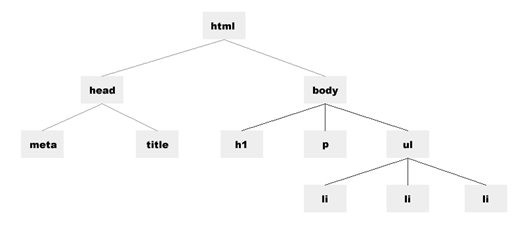
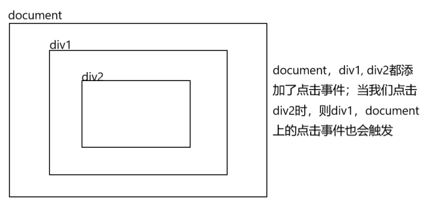
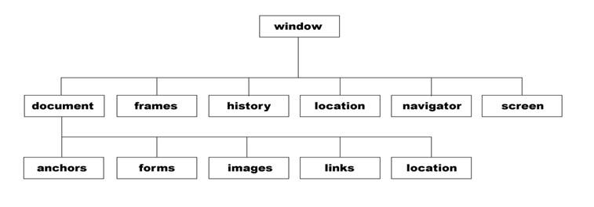

# DOM操作

## document对象

1. document对象表示整个HTML 页面
2. document.write()
3. document.body.style.background = 'red'


## 获取页面标签元素的方法API

### getElementById( )

```js
var oDiv = document.getElementById("div1");     //通过id名获取一个元素节点对象，获取页面文档id=div1的元素
var el = oDiv.getElementById("div2");			//获取oDiv元素下面 id=div2 的元素
```

### getElementsByTagName( )

```js
	/*getElementsByTagName() 返回的是一个类似于数组的对象，里边包含了获取到元素*/    

	//通过标签名来获取元素节点对象
    var op_arr =document.getElementsByTagName("p");		//获取页面所有的p标签
    alert(op_arr.length);
    alert(op_arr[0].innerHTML);  		//获取对象的内容
    alert(op_arr[1].innerHTML);
    alert(op_arr[2].innerHTML);
    alert(op_arr instanceof Array);  	//打印false 不是一个数组；
```

### getElementsByName( )

```js
	/*getElementsByName() 返回的是一个类似于数组的对象，里边包含了获取到元素*/     

	//获取带有指定名称的元素节点对象；
    var arr = document.getElementsByName("ok");	 // 获取页面中所有 name="ok" 的元素
    alert(arr.length);
    alert(arr[0].innerHTML);
    alert(arr[1].innerHTML);
```

### getElementsByClassName( )

```js
	/*getElementsByClassName() 返回的是一个类似于数组的对象，里边包含了获取到元素*/     
	document.getElementsByClassName("abc");		// 获取页面中所有 class="abc" 的元素

	// PS：getElementsByClass 不兼容IE8以下
```

### querySelector && querySelectorAll

1. querySelector 与 querySelectorAll小括号中，写css选择器，它们是通过css选择器来获取页面元素的
2. querySelector 只会一个对象
3. querySelectorAll  返回的是一个类似数组的对象

```js
	document.querySelector("p");	// 获取页面中第一p元素，如果页面中有多个p元素，也只会返回第一个
    
	document.querySelectorAll(".cl p");		//获取页面中 class='cl'标签 下的p 标签，返回一个类似于数组的对象
```

## innerHTML 和 innerText属性

```js
<div id="div1">
    我是一个div标签
	<h1>我是一个h1标签</h1>
</div>	

//innerHTML        //可以获取元素对象的内容
var oDiv = document.getElementById("div1");
alert(oDiv.innerHTML);    //会把HTML标签也获取到；
oDiv.innerHTML = "<p style='background:red'>我这一个p标签</p>"   //会解析字符串中的html标签

//innerText        //获取文本内容  会把html标签过滤掉;
alert(oDiv.innerText);
oDiv.innerText = "<p style='background:red'>我这一个p标签</p>"    //不会解析字符串中的html标签


//PS：innerHTML会解析字符串中的html标签，innerText不会解析字符串中的html标签
```


## 属性操作

1. 获取标签元素对象的标签名

   ```js
   // tagName                              获取元素节点的标签名
   var oDiv = document.getElementById("div1");
   alert( oDiv.tagName );   //打印DIV
   ```

2. 标签元素的内容

   ```js
   // innerHTML                            获取元素节点里的内容
   var oDiv = document.getElementById("div1");
   alert(oDiv.innerHTML);
   ```

3. 操作属性

   ```js
   var oDiv = document.getElementById("div1");
   // 获取属性值
   alert(oDiv.id);
   alert(oDiv.title);
   
   // 设置属性值
   oDiv.id = "div2";       //id 不建议改动
   oDiv.title = "小明";
   
   // 加属性
   oDiv.an = "你好";		
   oDiv.abc = "abc";
   oDiv.index = 2;        //给oDiv元素对象添加index属性
   alert(oDiv.index);     //可以打印值，但这样通过元素对象直接添加的属性，在页面标签中并不显示
   alert(oDiv.an);
   ```

4. Attr方法

   ```js
   // getAttribute()方法    获取元素节点属性的值;
   var oDiv = document.getElementById("div1");
   alert(oDiv.getAttribute("title"));
   
   // setAttribute()方法    设置元素节点对象属性 setAttribute(属性名,属性值);  通过setAttribute方法设置的属性 需要通过getAttribute 来获取
   oDiv.setAttribute("abc","abc");
   alert(oDiv.abc);    //打印undefined
   alert(oDiv.getAttribute("abc"));  //打印abc
   
   // removeAttribute()方法    //删除元素节点对象的属性
   oDiv.removeAttribute("abc");
   oDiv.removeAttribute("id");
   ```

5. 获取标签的class属性名

   ```js
   // 获取标签中的class属性值;
   var oDiv2 = document.getElementsByTagName("div")[1];
   alert(oDiv2.class);      //打印undefined， 需要通过className获取 class名
   alert(oDiv2.className);  //打印div2
   
   // 设置
   oDiv2.className = "div3";
   ```

## 表单元素操作


## 样式操作

1. 获取样式值

   ```html
   <!DOCTYPE html>
   <html lang="en">
   <head>
       <meta charset="UTF-8">
       <title>Title</title>
       <style>
           #div1{ background: red; }
       </style>
   </head>
   <body>
       <div id="div1" style="width: 100px; height: 100px; font-size: 24px">11111</div>
       <script>
           var oDiv = document.getElementById("div1");
   
           alert(oDiv.style);   			    // [object CSSStyleDeclaration]
           var w = oDiv.style.width;
           alert(w);                           //100px
           alert( oDiv.style.font-size );      //报错
           alert( oDiv.style.fontSize );       //打印24px
           alert( oDiv.style["font-size"]   ); //打印24px
           alert( oDiv.style.background );     //打印一个空串
           
           // PS： 通过  元素对象.style 的方式  只能获取行内样式，不能获取内部样式表 ， 外部样式
       </script>
   </body>
   </html>
   
   ```

2. 设置样式值

   ```js
   // 设置样式属性值
   oDiv.style.background = "blue";				
   oDiv.style.backgroundColor = "green";		
   
   //PS：通过  元素对象.style 的方式 添加的样式，都是行内样式， 会把样式直接添加到标签上
   ```

3. 获取样式完整写法

   ```js
   // 定义一人函数，接收两个参数，第一个参数表示标签元素对象，第二个参数是要元素对象的属性
   function getStyle(obj,attr){
       
       // currentStyle，getComputedStyle可以获取到内部样式 和 外部样式
       if(obj.currentStyle){	
           return obj.currentStyle[attr];					//兼容IE8以下
       }else{
           return window.getComputedStyle(obj,null)[attr];	//除了IE8外的其它浏览器
       }
   }
   
   //使用
   var oDiv = document.getElementById("div1");
   getStyle(oDiv, 'background')
   ```

## node节点简介

加载HTML页面时，Web浏览器生成一个树型结构，用来表示页面内部结构。DOM将这种树型结构理解为由节点组成 （节点树）

 

节点的类型有12种，比如：元素节点，属性节点，文本节点 等等

```js
/*
    Node对象
        节点对象都有三个属性：nodeName，nodeType，nodeValue;

        元素节点    nodeName=元素名    nodeType=1    nodeValue=null
        属性节点    nodeName=属性名    nodeType=2    nodeValue=属性值
        文本节点    nodeName=#text     nodeType=3    nodeValue=文本内容
*/
<div id="div1">这里是一个div</div>
// 这里的div则就是一个元素节点，标签中的id属性则为属性节点，而里边的文本就是一个文本节点
```

## 节点操作的方法

### firstChild 和 lastChild方法

```js
<ul id="list">654764575
    <li>1111111111</li>
    <li>2222222222</li>
    <li>3333333333</li>
    <li>4444444444</li>
    <li>5555555555</li>
</ul>


// firstChild方法          获取当前元素节点的第一个子节点
var oList = document.getElementById("list");
var first = oList.firstChild;
alert(first.nodeValue);

var first = oList.firstElementChild;     //在IE下不兼容
var first = oList.firstChild;            //只兼容IE8下以;
var first = oList.firstElementChild || oList.firstChild;  //获取第一个元素子节点 兼容;
first.style.background = "red";
alert(first.innerHTML);

// lastChild                  获取当前元素节点的最后一个子节点
var last = oList.lastElementChild || oList.lastChild; // 获取第一个元素子节点 兼容;
last.style.background = "red";
```

### previousSibling 和 nextSibling方法

```js
<ul id="list">
    <li>1111111111</li>
    <li>2222222222</li>
    <li id="li1">3333333333</li>
    <li>4444444444</li>
    <li>5555555555</li>
</ul>

// previousSibling       获取当前节点的前一个同级节点
var oLi1 = document.getElementById("li1");
var oLi1_pre = oLi1.previousSibling;
var oLi1_pre = oLi1.previousElementSibling;
var oLi1_pre = oLi1.previousElementSibling || oLi1.previousSibling;  //兼容  获取当前节点的前一个元素节点
oLi1_pre.style.background = "red";


// nextSibling           获取当前节点的后一个同级节点
var oLi1_next = oLi1.nextElementSibling || oLi1.nextSibling;       //兼容  获取当前节点的后一个元素节点
oLi1_next.style.background = "red";
```

### childNodes方法

```js
<ul id="list">
    <li>1111111111</li>
    <li>2222222222</li>
    <li>3333333333</li>
    <li>4444444444</li>
    <li>5555555555</li>
</ul>

// childNodes             获取当前元素节点的所有子节点
var oList = document.getElementById("list");
var oList_node = oList.childNodes;
alert(oList_node.length);   //打印11
var oList_element =  oList.children;    //获取当前元素节点下的所有元素子节点；
alert(oList_element.length);
```

### attributes属性

```js

<ul id="list" title="小明">
    <li>111111111</li>
    <li id="li1">222222222</li>
    <li>333333333</li>
    <li>444444444</li>
    <li>555555555</li>
</ul>

// attributes                 获取当前元素节点的所有属性节点集合
var oUl = document.getElementById("list");
var arr = oUl.attributes;
alert(arr.length);
alert(arr[0].nodeType);
alert(arr[1].nodeValue);
alert(arr[1].nodeName);
```

 ### parentNode属性

```js
<ul id="list">
    <li>111111111</li>
    <li id="li1">222222222</li>
    <li>333333333</li>
    <li>444444444</li>
    <li>555555555</li>
</ul>

//parentNode属性    获取当前节点的父节点
var oLi1 = document.getElementById("li1");
var oUl = oLi1.parentNode;
alert(oUl);
alert(oUl.nodeName);
```

### createElement方法

```js
// createElement()        创建一个元素节
var oLi = document.createElement("li");
oLi.style.background = "red";	// 给创建的li元素 添加样式
console.log(oLi);
```

### appendChild方法

```js
<ul id="list">
    <li>111111111</li>
    <li id="li1">222222222</li>
    <li>333333333</li>
    <li>444444444</li>
    <li>555555555</li>
</ul>

// appendChild()           将新节点追加到子节点列表的末尾
var oList = document.getElementById("list");
var obj = document.createElement("li");   //创建一个新节点
obj.innerHTML = "我是创建一个新的li";
obj.style.background = "red";
oList.appendChild(obj);   				//把创建一个新节点添加到UL中;
```

### removeChild方法

```js
<ul id="list">
    <li>111111111</li>
    <li id="li1">222222222</li>
    <li>333333333</li>
    <li>444444444</li>
    <li>555555555</li>
</ul>

// removeChild()     移除节点	
var oLi1 = document.getElementById("li1");
oLi1.parentNode.removeChild(oLi1);			//父节点.removeChild(要移除的子节点)			
```

###  replaceChild方法

```js
<ul id="list">
    <li>111111111</li>
    <li id="li1">222222222</li>
    <li>333333333</li>
    <li>444444444</li>
    <li>555555555</li>
</ul>

// replaceChild()           将新节点替换旧节点
var obj = document.createElement("li");
obj.innerHTML = "我是一个新创建的li";
obj.style.background = "red";

var oLi1 = document.getElementById("li1");
oLi1.parentNode.replaceChild(obj,oLi1);			//父节点.replaceChild(要替换的旧的子节点，新节点)
```

### insertBefore方法

```js
<ul id="list">
    <li>111111111</li>
    <li id="li1">222222222</li>
    <li>333333333</li>
    <li>444444444</li>
    <li>555555555</li>
</ul>

// insertBefore()            将新节点插入在前面
var obj = document.createElement("li");
obj.innerHTML = "我是一个新创建的li";
obj.style.background = "red";

var oLi1 = document.getElementById("li1");
oLi1.parentNode.insertBefore(obj,oLi1);    		//父节点.insertBefore(要插入的节点，指定的节点);

// 下面这行代码可以让新元素 插入到 目标元素之后
oLi1.parentNode.insertBefore( oLi1.nextSibling , oLi1);
```

### cloneNode方法

```js
<ul id="list">
    <li>111111111</li>
    <li id="li1">222222222</li>
    <li>333333333</li>
    <li>444444444</li>
    <li>555555555</li>
</ul>

// cloneNode()              复制节点
var oLi1 = document.getElementById("li1");
oLi1.style.background = "red";
oLi1.onclick = function(){			//添加事件
    alert("1111111");
}

var obj = oLi1.cloneNode(true);		//复制元素节点
alert(obj == oLi1);					

var oList = document.getElementById("list");	
oList.appendChild(obj);				

// cloneNode复制 只能复制节点的内容，样式；但是不能复制节点上事件
```

### write方法方法

```js
// write()          这个方法可以把任意字符串插入到文档中
var str = "小明<br />"
var str1 = "<h1>好帅</h1>";
document.write(str);
document.write(str1);
```

## 元素大小与位置

### clientWidht 和 clientHeight方法

```js
<style type="text/css">
    #div1{
        width: 100px;
        height: 100px;
        background: red;
        /*padding: 10px;*/   					/*如果有内边距，clientWidht的值就是原来的大小加上内边中的大小*/
        /*margin: 10px; */       				/*加上外边距，值不变*/
        /*border: 10px solid darkolivegreen;*/	 /*加上边框，值不变*/
        overflow: auto;  					   /*如果有滚动想知条，clientWidht的值就是原来的大小减去滚动条的大小*/
    }
</style>

<div id="div1">
    1111111111111111111111<br/>
    1111111111111111111111<br/>
    1111111111111111111111<br/>
    1111111111111111111111<br/>
    1111111111111111111111<br/>
    1111111111111111111111<br/>
    1111111111111111111111<br/>
    1111111111111111111111<br/>
    1111111111111111111111<br/>
    1111111111111111111111<br/>
 </div>

//clientWidht与clientHeight 这两属性可以获取元素可视区的大小，它会加上内边距大小
var oDiv = document.getElementById("div1");
alert(oDiv.clientWidth);
alert(oDiv.clientHeight);

var num = document.body.clientWidth;

// 获取当前页面可视大小(做兼容处理)
var num = document.documentElement.clientWidth || document.body.clientWidth;
var num = document.documentElement.clientHeight || document.body.clientHeight;
alert(num);
```

### offsetHeight 和 offsetWidth方法

```js
#div1{
    width: 100px;
    height: 100px;
    background: red;
    /*padding: 10px;*/
    /*overflow: auto;*/
    /*border: 10px solid black;*/
    /*margin: 10px;*/     /*值不变*/
}
            
<div id="div1">
    111111111111111111111111<br/>
    111111111111111111111111<br/>
    111111111111111111111111<br/>
    111111111111111111111111<br/>
    111111111111111111111111<br/>
    111111111111111111111111<br/>
    111111111111111111111111<br/>
    111111111111111111111111<br/>
    111111111111111111111111<br/>
    111111111111111111111111<br/>
    111111111111111111111111<br/>
    111111111111111111111111<br/>
</div>

// offsetHeight 与 offsetWidth   获取元素的实际大小   它会包括边框，滚动条和内边距;
var oDiv = document.getElementById("div1");

alert(oDiv.offsetHeight);
alert(oDiv.offsetWidth);
```

### clientLeft 和 clientTop属性

```js
#div1{
    width: 100px;
    height: 100px;
    background: red;
    border-left: 50px solid black;
    border-top: 30px solid black
}

<div id="div1"></div>

// clientLeft 与 clientTop  这组属性可以获取元素设置了左边框和上边框的大小。
var oDiv = document.getElementById("div1");
alert(oDiv.clientLeft);     //获取元素对象的左边框的大小
alert(oDiv.clientTop);      //获取元素对象的上边框的大小
alert(oDiv.clientRight);    //undefined;
```

### offsetLeft 与 offsetTop属性

```js
#div1{
    width: 500px;
    height: 500px;
    background: red;
    position: relative;
    margin: 1px;    /*如果有外边距，就是加上外边距的距离*/
    /*padding: 50px;*/     /*不变*/
    /*border: 10px solid black;*/
    left: 500px;
}
#div2{
    width: 100px;
    height: 100px;
    background: green;
    position: absolute;
    left: 200px;
    top: 200px;
}

<div id="div1">
    <div id="div2"></div>
</div>
 
//offsetLeft 与 offsetTop   获取元素对象的左边距与上边距   
var oDiv = document.getElementById("div1");
console.log(oDiv.offsetLeft);	// 509
console.log(oDiv.offsetTop);	// 8

var oDiv2 = document.getElementById("div2");	// ps获取的值是相对于定位父级元素;
console.log(oDiv2.offsetLeft);	// 200
console.log(oDiv2.offsetTop);	// 200
```

### 滚动条相关操作

```js
#div1{
    width: 100px;
    height: 300px;
    background: red;
    overflow: auto;
}
        
<input id="btn" type="button" value="确定" />
<div id="div1">
    11111111111111111111<br/>
    11111111111111111111<br/>
    11111111111111111111<br/>
    11111111111111111111<br/>
    11111111111111111111<br/>
    11111111111111111111<br/>
    11111111111111111111<br/>
    11111111111111111111<br/>
    11111111111111111111<br/>
    11111111111111111111<br/>
    11111111111111111111<br/>
    11111111111111111111<br/>
    11111111111111111111<br/>
    11111111111111111111<br/>
    11111111111111111111<br/>
    11111111111111111111<br/>
    11111111111111111111<br/>
    11111111111111111111<br/>
    11111111111111111111<br/>
    11111111111111111111<br/>
    11111111111111111111<br/>
    11111111111111111111<br/>
    11111111111111111111<br/>
    11111111111111111111<br/>
    11111111111111111111<br/>
    11111111111111111111<br/>
    11111111111111111111<br/>
</div>


// scrollHeight：在没有滚动条的情况下，元素内容的总高度。
// scrollWidth：在没有滚动条的情况下，元素内容的总宽度。
// scrollLeft：被隐藏在内容区域左侧的像素数。通过设置这个属性可以改变元素的滚动位置。
// scrollTop：被隐藏在内容区域上方的像素数。通过设置这个属性可以改变元素的滚动位置。
	
var oDiv = document.getElementById("div1");
var oBtn = document.getElementById("btn");
oBtn.onclick = function(){
    alert(oDiv.scrollTop);
    alert(oDiv.scrollLeft);
    
    alert(oDiv.scrollHeight);
}
```

### scrollIntoView方法

```js
<button id="btn">点击跳转</button>

<br><br><br><br><br><br><br><br><br><br><br><br><br><br><br><br><br><br><br><br><br><br><br><br><br>
<br><br><br><br><br><br><br><br><br><br><br><br><br><br><br><br><br><br><br><br><br><br><br><br><br>
<br><br><br><br><br><br><br><br><br><br><br><br><br><br><br><br><br><br><br><br><br><br><br><br><br>
<br><br><br><br><br><br><br><br><br><br><br><br><br><br><br><br><br><br><br><br><br><br><br><br><br>

<div id="div1">我是一个div标签</div>

<br><br><br><br><br><br><br><br><br><br><br><br><br><br><br><br><br><br><br><br><br><br><br><br><br>
<br><br><br><br><br><br><br><br><br><br><br><br><br><br><br><br><br><br><br><br><br><br><br><br><br>
<br><br><br><br><br><br><br><br><br><br><br><br><br><br><br><br><br><br><br><br><br><br><br><br><br>
<br><br><br><br><br><br><br><br><br><br><br><br><br><br><br><br><br><br><br><br><br><br><br><br><br>
        
// scrollIntoView方法；作用可以在滚动条定位到指定的元素位置
var oBtn = document.getElementById("btn");
var oDiv = document.getElementById("div1");
oBtn.onclick = function(){
    oDiv.scrollIntoView();
}
```

# 事件操作

## 事件流

1. 事件流是描述的从页面接受事件的顺序，比如给几个层叠在一起的元素添加点击事件，当点击最里层的元素时，事件流是描述的从页面接受事件的顺序，比如给几个层叠在一起的元素添加点击事件，当点击最里层的元素时，而是层叠在点击范围内的所有元素都会触发事件

2. 事件流包括两种模式：事件冒泡（即事件从中心往外触发）  和 事件捕获（即事件从外面往中心触发）。

3. 图解

    

## 事件冒泡(阻止冒泡)

```html
<!DOCTYPE html>
<html>
<head>
	<meta charset="UTF-8">
	<meta name="description" content="">
	<meta name="keywords" content="">
	<title>Examples</title>
	<style type="text/css">
		#div1 {
			width: 500px;
			height: 500px;
			background: red;
			position: relative;
		}

		#div2 {
			width: 100px;
			height: 100px;
			background: blue;
			position: absolute;
			top: 150px;
			left: 150px;
		}
	</style>
</head>
<body>
	<div id="div1">
		<div id="div2"></div>
	</div>
    
	<script type="text/javascript">
        var oDiv1 = document.getElementById("div1");
        var oDiv2 = document.getElementById("div2");
        oDiv1.onclick = function () {
            alert("div1点击事件触发");
        };
        
		oDiv2.onclick = function (ev) {
            alert("div2点击事件触发");
            // 阻止事件捕获或冒泡行为
            var oEvent = ev || event;
            if (oEvent.stopPropagation) {
                oEvent.stopPropagation()	//兼容其它浏览器
            } else {
                oEvent.cancelBubble = true	//兼容IE
            }
        }
	</script>
</body>
</html>

```

## 事件处理程序

1. 事件就是用户或浏览器自身执行的某种动作。诸如click、load 和mouseover，都是事件的名字。而响应某个事件的函数就叫做事件处理程序（或事件侦听器）。事件处理程序的名字以"on"开头，因此click 事件的事件处理程序就是onclick
2. 为事件指定处理程序的方式有好几种：HTML事件处理程序，DOM0 级事件处理程序，事件绑定

### HTML事件处理程序

```html
指定HTML事件处理程序，即就是在标签中直接添加事件
<h1 onclick="alert('OK')">h1标签</h1>

还可以这样
<h1 onclick="showTime(this, '小明', 12)">h1标签</h1>	点击h1会触发showTime函数，this表示当前点击的h1元素
<script type="text/javascript">
    function showTime(el, username, age) {
        console.log(el, username, age);
    }
</script>
```

### DOM0 级事件处理程序

```js
<h1 id="hh">h1标签</h1>


//指定DOM0级事件处理程序，即通过DOM标签元素对象添加事件
<script type="text/javascript">
    var elObj = document.getElementById("hh");		//获取h1标签元素对象
    elObj.onclick = function () {					//给h1标签元素对象添加事件
		alert("你点击了h1标签")
    };

	//删除事件
	elObj.onclick = null;							//删除事件处理程序
</script>


//还可以这样这样
<script type="text/javascript">
    var elObj = document.getElementById("hh");		//获取h1标签元素对象
    elObj.onclick = showTime;						//给h1标签元素对象添加事件
	function showTime = function(){
        alert("你点击了h1标签")
    }
</script>


```

### 事件绑定

1. 绑定两个相同的事件

   ```js
   /*
   	1. 通过事件绑定可以一个元素添加多个相同的事件，比如给一个div添加两个onclick事件，且两个点击事件都会生效
   	2. 通过事件绑定我们可以设置事件流，是事件冒泡，还是事件捕获
   	3. 绑定时用于处理添加和删除事件处理程序的操作：addEventListener("去掉on的事件名", 事件处理程序的函数, 布尔值) 和 removeEventListener()
   	4. addEventListener的第三个参数布尔值，false表示事件冒泡流，true表示事件捕获流
   	5. 在取消事件绑定时，removeEventListener()里的参数需要与绑定时addEventListener()中的参数保持一致
   	6. addEventListener，removeEventListener在IE8以下不兼容
   	7. 在IE8以下绑定和取消事件的方法分别是：attachEvent()，detachEvent()
   */
   
   <h1 id="hh">h1标签</h1>
   
   <script type="text/javascript">
       
       //通过事件绑定可以一个元素添加多个相同的事件，比如给一个div添加两个onclick事件，且两个点击事件都会生效
       var elObj =  document.getElementById("hh");
       elObj.addEventListener('click', function () {	// 给h1绑定一个点击事件
           console.log("绑定的第1个click事件");
       }, false)
   	elObj.addEventListener('click', function () {
           console.log("绑定的第2个click事件");
       }, false)
   </script>
   ```

   

2. 取消绑定事件（失败写法）

   ```js
   <h1 id="hh">h1标签</h1>
   
   <script type="text/javascript">
       
       
       var elObj =  document.getElementById("hh");
       elObj.addEventListener('click', function () {		//绑定一个点击事件
           console.log("绑定的第1个click事件");
       }, false)
   
   
   	
       elObj.removeEventListener('click', function () {	//取消绑定的事件
           console.log(1111111);
       }, false);
   	//Ps: 这里事件取消会失败，因为在取消事件绑定时，removeEventListener()里的参数需要与绑定时addEventListener()中的参数保持一致，
   	//    而这里的第二参数很明显是两个独立的函数
   </script>
   ```

   

3. 取消绑定事件（失败写法）

   ```js
   <h1 id="hh">h1标签</h1>
   
   <script type="text/javascript">
       function showTime = function(){
           console.log(1111111);
       }
       
       var elObj =  document.getElementById("hh");
       elObj.addEventListener('click', showTime, false);		//绑定一个点击事件
   
       elObj.removeEventListener('click', showTime, false);	//取消绑定的事件
   	//PS: 这里取消绑定会成功，因为所有的参数都一样了
   </script>
   ```

   

4. 事件绑定IE8兼容写法

   ```js
   <h1 id="hh">h1标签</h1>
   <script type="text/javascript">
       var elObj = document.getElementById("hh");
       function showTime() { console.log(11); }
   
       //事件绑定
       if(elObj.addEventListener){
           elObj.addEventListener('click',showTime,false);
       }else{
           elObj.attachEvent("onclick",showTime);	// IE8以下的兼容处理
       }
   
       //取消事件绑定
       if(elObj.removeEventListener){
           elObj.removeEventListener('click',showTime,false);
       }else{
           elObj.detachEvent("onclick",showTime);  // IE8以下的兼容处理
       }
   </script>
   ```

   

5. 事件绑定最后封装

   ```js
   //obj  表示要绑定的事件的对象，
   //type 表示要绑定的事件类型
   //fin  表示事件触发要执行的函数
   function addEvent(obj,type,fin){	
       if(obj.addEventListener){
           obj.addEventListener(type,fin,false);
       }else{
           //IE8以下的兼容处理
           obj.attachEvent("on"+type,fin);
       }
   }
   
   //事件移除;
   function removeEvent(obj,type,fin){
       if(obj.removeEventListener){
           obj.removeEventListener(type,fin,false);
       }else{
           obj.detachEvent("on"+type,fin);
       }
   }
   
   
   function showTime = function(){console.log(111);}
   addEvent(elObj, 'click', showTime)		//给elObj元素对象绑定 点击事件
   removeEvent(elObj, 'click', showTime)	//取消elObj元素对象的 点击事件
   ```

## 事件处理程序的函数中的this

```js
/*
	事件处理程序的函数中的this，表示的是当前触发这个事件的那个元素对象
*/
<h1 id="hh">h1标签</h1>
<script type="text/javascript">

    var elObj = document.getElementById("hh");

    function showTime(){ console.log(this); }	//当点击h1元素触发点击事件时，这里执行的this就是我们点击的h1元素

    elObj.onclick = showTime;

</script>
```

## 事件对象

1. 我们在DOM页面中触发一个事件时，都有默认产生一个事件对象event

2. 这个事件对象中包含着所有与事件有关的信息，比如：事件类型，触发事件DOM元素

3. 事件对象中常见属性：

   |    事件对象属性    |                           属性描述                           |
   | :----------------: | :----------------------------------------------------------: |
   |       target       |           事件的目标；页面中实际操作的那个DOM元素            |
   |   currentTarget    | 其事件处理程序当前正在处理事件的那个元素；添加事件的那个DOM元素，相当事件处理程序函数中的this |
   |      clientY       | 在鼠标事件中，它表示当前鼠标在可视窗口中的纵坐标，这与是否有滚动区域视图无关，重点是可视窗口 |
   |      clientX       |          clientX 与 clientY一样，但它表示的是横坐标          |
   |       pageY        | 在鼠标事件中，它表示当前鼠标在窗口中的纵坐标，如果有滚动区域视图，则需要算上滚动区域视图 |
   |       pageX        |            pageX 与 pageY一样，但它表示的是横坐标            |
   | stopPropagation( ) | 可能阻止事件冒泡或者捕获，但在IE中兼容性不好，可以event.cancelBubble = true做兼容IE处理 |
   | preventDefault( )  | 阻止事件的默认行为，例如可以在onsubmit事件中，通过event.preventDefault( )阻止表单的默认提交行为，但是IE8以下是不兼容的，但可以通过return false来阻止表单的默认提交行为 |
   |        type        |                      被触发的事件的类型                      |

4. 阻止表单默认提交行为

   ```html
   	<form action="https://www.360.com" id="form2">
   		<input type="submit">
   	</form>
   
   	<script>
   		var elForm = document.getElementById("form2");
           
           elForm.onsubmit = function (ev) {	//给表单添加onsubmit事件，当表单提交时触发执行
   		    var ev = ev || event;
               console.log(11);
               
               // ev.preventDefault();			IE8以下不兼容
   			return false;					// 返回false可以阻止表单的默认提交行为				
           }
   	</script>
   ```

   

## 事件委托

1. 使用事件委托可以让  整个页面占用的内存空间更少，能够提升整体性能。

2. 使用事件委托可以让  页面中设置事件处理程序所需的时间更少。因为添加一个事件处理程序所需的DOM 引用更少，所以花的时间也更少。

3. 不使用事件委托的案例

   ```html
   	<ul id="ulList">
   		<li>第1个li</li>
   		<li>第2个li</li>
   		<li>第3个li</li>
   	</ul>
   	
   	<script>
           /* 当前点击每一个li标签时，就在控制台打印点击的li的内容 */
           var elUl = document.getElementById("ulList");	
           var elLis = elUl.getElementsByTagName("li");	
           for (var i in elLis) {							//遍历所有li元素对象，给每一个li添加点击事件
               elLis[i].onclick = function () {
                   console.log(this.innerText)				//打印当前点击的li的内容
               }
           }
   	</script>
   ```

   

4. 使用事件委托的案例

   ```html
   	<ul id="ulList">
   		<li>第1个li</li>
   		<li>第2个li</li>
   		<li>第3个li</li>
   	</ul>
   
   	<script>
           var elUl = document.getElementById("ulList");
           
           //给ul添加点击事件，因为事件冒泡，当我们点击li时，所以这里ul上的点击事件也会被执行
           elUl.onclick = function(ev){
               var ev = ev || event;	
               console.log(ev.target.innerText);	// 这里的ev.target表示是 我们在页面中实际点击的那个标签元素
           }
   	</script>
   ```

   

5. 事件委托小案例

   ```html
   	<ul id="ulList">
   		<li id="redLi">第1个li</li>
   		<li id="blueLi">第2个li</li>
   		<li id="greenLi">第3个li</li>
   	</ul>
   
   	<script>
           /*需求：
           	点击第1个li时，页面变红色；
           	点击第2个li时，页面变蓝色；
           	点击第3个li时，页面变绿色；
           */
           var elUl = document.getElementById("ulList");
           elUl.onclick = function(ev){
               var ev = ev || event;
               switch (ev.target.id) {
   				case 'redLi':
   				    document.body.style.background = 'red';
   				    break;
   				case 'blueLi':
                       document.body.style.background = 'blue';
                       break;
   				case 'greenLi':
                       document.body.style.background = 'green';
                       break;
               }
           }
           
           //PS：这里其实主要通过li标签中id属性，来判断点击的哪一个Li
   	</script>
   ```

   

## 事件类型

1. 鼠标事件

   |    事件名    |               描述               |
   | :----------: | :------------------------------: |
   |   onclick    |      单击鼠标左键按钮时触发      |
   |  ondblclick  |           双击后触发；           |
   | onmousedown  | 按下鼠标左键  但还没有弹起时触发 |
   |  onmouseup   |   按下鼠标左键  并且抬起后触发   |
   | onmousemove  |      按住鼠标左键移动时触发      |
   | onmouseover  |  鼠标移入进时触发（会事件冒泡）  |
   |  onmouseout  |   鼠标移出时触发（会事件冒泡）   |
   | onmouseenter | 鼠标移入进时触发（不会事件冒泡） |
   | onmouseleave |  鼠标移出时触发（不会事件冒泡）  |

   

2. 焦点事件

   |   事件名   |                             描述                             |
   | :--------: | :----------------------------------------------------------: |
   |   onblur   |  在元素失去焦点时触发。这个事件不会冒泡；所有浏览器都支持它  |
   |  onfocus   |  在元素获得焦点时触发。这个事件不会冒泡；所有浏览器都支持它  |
   | onfocusout | 在元素失去焦点时触发。这个事件与HTML 事件blur 等价，但它冒泡 |
   | onfocusin  | 在元素获得焦点时触发。这个事件与HTML 事件focus 等价，但它冒泡 |

   

3. html事件

   |  事件名  |                             描述                             |
   | :------: | :----------------------------------------------------------: |
   |  onload  |   等完全加载所有的内容（包括图片，视频，脚本等），就触发；   |
   | onchange |            当文本框内容改变时并且失去焦点后触发;             |
   | onsubmit |                 当用户点击表单提交按钮时触发                 |
   | onreset  |                   当用户点击重置按钮时触发                   |
   | onselect | select：当用户选择文本框（<input>或<texterea>）中的一或多个字符时触发 |
   | onresize |      当窗口或框架的大小变化时在window 或框架上面触发。       |
   | onscroll | 当用户滚动带滚动条的元素中的内容时，在该元素上面触发。<body>元素中包含所加载页面的滚动条 |

   

4. 键盘事件

   |   事件名   |                       描述                        |
   | :--------: | :-----------------------------------------------: |
   | onkeydown  | 当用户按下键盘时会触发，如果按住不动，会重复触发; |
   |  onkeyup   |                当用户抬起键时触发                 |
   | onkeypress |    按下字符键时触发，如果按住不放，会重复触发     |

   

5. 


# BOM操作

## window对象

### window对象简介

1. 在Web浏览器中，全局环境被认为就是window对象，

2. 在全局环境中定义的变量与函数，都是作为window对象的属性与方法创建的

   ```js
   var age = 12;
   alert(age);
   alert(window.age);	// 在全局环境中定义的变量与函数，都是作为window对象的属性与方法创建的
   alert(this.age);	// 这里的全局环境中的this指的是window对象
   
   
   //window对象 的name 属性与 top属性
   //name：窗口名
   //top： 最顶层的窗口 (框架中使用)；
   
   var name = 123;		  //window对象默认有一个name属性，表示窗口名，这里的值改变无效
   alert(name);
   alert(typeof name);   //打印类型为String
   var top = true;
   alert(top);           //打印window对象
   ```

3. window对象结构图片

    

   

### 弹出框

1. 警告框

   ```js
   alert("我被弹出了");
   window.alert("我被弹出了");
   ```

2. 取消与确定框

   ```js
   // confirm("请确定或者取消");   //这里是有一个返回值，点击确定返回true  取消就返回false
   var bool = confirm("请确定或者取消");
   if(bool){
       alert("你选择了确定");
   }else{
       alert("你选择了取消");
   }
   ```

3. 输入提示框

   ```js
   // 输入提示框
   var num = prompt("请输入一个字串","请输入你的银行卡密码");   //一样可以把输入内容给返回
   alert(num);
   alert(typeof num);
   ```

### 窗口打开与关闭

```js
//  open()方法，打开一个新的窗口，且返回一个新窗口的window对象
var windowObj = open("https://www.baidu.com/","_blank","width=100px; height=100px; left=500px; top=500px");

// close()  关闭窗口
document.onclick = function(){
    close();	// 关掉当前窗口
}
```

### 定时器

1. 超时调用的定时器

   ```js
   //setTimeout();      //设置超时调用，作用是过了指的时间量时会执行，且会执行一次
   //clearTimeout();    //取消超时调用
   
   //超时调用的使用
   var outTimer = setTimeout(function(){			//设置一个超时调用 的 定时器，2000毫秒后会执行函数，且只会执行一次
       alert("小明");
   },2000);
   
   var oBtn = document.getElementById("btn");
   oBtn.onclick = function(){
       clearTimeout(outTimer);						//关闭上面定义超时调用的定时器
   }
   ```

2. 间歇调用的定时器

   ```js
   //setInterval();      //设置间歇调用，作用是每过指定的时间量，就会执行一次，且不会自己停止；
   //clearInterval();    //取消间歇调用
   
   //间歇调用的使用
   var outTimer = setInterval(function(){			//设置一个间歇调用 的 定时器，每过2000毫秒就会一次执行函数，会一直执行
       alert("小明");
   },2000);
   
   var oBtn = document.getElementById("btn");
   oBtn.onclick = function(){
       clearInterval(outTimer);					//关闭上面定义间歇调用的定时器
   }
   ```

### 其它

```js

//窗口的位置与大小
// screenLeft 与 screenTop    确定浏览器窗口与显示屏  左边和上边的距离
alert(screenTop);
alert(screenLeft);    //在火狐中不兼容

alert(screenY);       //在火狐可以
alert(screenX);


//screenY属性  如果直接alert(screenY),在ie8以下会把它一个没有声名一个变量
var topY = window.screenY || screenTop;		//兼容处理
alert(topY);


// 调整浏览器的位置（只限IE支持） 注意:因为此方法被浏览器禁用   一般很少用
moveTo(0,0);    //直接移动到0,0坐标;
moveBy(50,50);   //会从原有的位置开始移动
resizeTo(1,1);   //调整大小
resizeBy(-50,-50);  //在原有的基础上调
```

## location对象

1. location对象  提供了与当前窗口中加载的文档有关的信息，还提供了一些导航功

2. 它既是window 对象的属性，也是document 对象的属性 ，也就是说  window.location === document.location

   ```js
   alert(location);
   alert(window.location);
   alert(document.location);
   alert(window.location == document.location);    //打印true
   
   
   // port属性   端口号
   console.log(location.port);   //获取端口号
   location.port = 8082;   	//设置端口号并且跳转
   
   
   // hostname属性	 服务器名称
   location.hostname = "OK";   //设置并且跳转
   
   
   // pathname属性    URL中的目录和（或）文件名
   location.pathname = "Test1/index.jsp";    //设置并且 跳转
   
   
   // href属性        返回当前加载页面的完整URL
   location.href = "http://www.360.com";   //跳转到http://www.360.com
   
   
   // search属性      返回URL的查询字符串
   location.search = "?name='小明'$password='123456'";
   console.log( location.search );
   
   
   /*===================================================================================================*/
   /* 设置页面跳转 */
   document.ondblclick = function () {
       // location.href = 'https://www.360.com';		//会跳转到360页面，并且在跳转后的页面中，还可以返回之前的页面
       // window.location = 'https://www.360.com';		//和上面的作用是一样的
       
       
       location.replace('https://www.360.com')			//会跳转到360页面，但是在跳转后的页面中，不可以返回之前的页面
   };
   ```

## history 对象

1. 因为history 是window对象的属性

2. history 对象保存着用户上网的历史记录

3. 通过history对象可以实现 页面后退和前进的操作。

   ```js
   //length属性  history对象中的记录数;
   console.log( history.length );
   document.ondblclick = function(){
       location.hash = "#44444";		//双击页面，这里就会在页面记录中添加一条条件
   }
   
   
   //back()方法     前往浏览器历史目前一个rul， 类似后退;
   //forward()方法  前往浏览器历史下一个rul , 类似前进
   //go(index)      浏览器history对象 前进或者后退;   如果为负数就后退，为正就前进  相对于当前的页面；
   <button id="btn1">后退</button>
   <button id="btn2">前进</button>
   <button id="btn3">前进或者后退</button>
   
   var oBtn1 = document.getElementById("btn1");
   oBtn1.onclick = function(){
       history.back();		// 后退
   }
   
   var oBtn2 = document.getElementById("btn2");
   oBtn2.onclick = function(){
       history.forward();	//前进
   }
   
   var oBtn3 = document.getElementById("btn3");
   oBtn3.onclick = function(){
       history.go(1);		//前进一个页面
   }
   ```

## 小案例

### 定时器与随机选择

```html
<!DOCTYPE html>
<html>
<head>
	<meta charset="UTF-8">
	<meta name="description" content="">
	<meta name="keywords" content="">
	<title>Examples</title>
	<style type="text/css">
		#warp {
			width: 120px;
			height: 120px;
			position: relative;
			margin: 100px auto;
		}
		#btn1 {
			float: left;
		}
		#btn2 {
			float: right;
		}
		#div1 {
			width: 120px;
			height: 120px;
			background: #ccc;
			text-align: center;
			font-size: 1em;
			line-height: 120px;
			font-weight: bold;
		}
	</style>

</head>
<body>
	<div id="warp">
		<div id="div1">小胖</div>
		<button id="btn1">开始</button>
		<button id="btn2">停止</button>
	</div>


	<script type="text/javascript">

        var arr = ["小胖", "小明", "小刘", "小红", "米粒", "哪吒", "key", "铁柱"];
        var oDiv = document.getElementById("div1");
        var oBtn1 = document.getElementById("btn1");
        var oBtn2 = document.getElementById("btn2");

        var timer = null;
        oBtn1.onclick = function () {
            timer = setInterval(function () {
                var num = parseInt(Math.random() * arr.length);
                oDiv.innerHTML = arr[num];

            }, 50);

        };
        oBtn2.onclick = function () {
            clearInterval(timer);
        }
	</script>
</body>
</html>
```

### 定时跳转页面

```html
<!DOCTYPE html>
<html>
<head>
	<meta charset="UTF-8">
	<meta name="description" content="">
	<meta name="keywords" content="">
	<title>Examples</title>
	<style type="text/css">
		#div1 {
			width: 200px;
			height: 200px;
			background: #ccc;
			text-align: center;
			font-size: 1.6em;
			line-height: 200px;
		}
	</style>
	
</head>
<body>
	<div id="div1"></div>

	<script type="text/javascript">
        var oDiv = document.getElementById("div1");
        var num = 3;
        var timer = null;
        oDiv.innerHTML = num + "秒后自动跳转";
        timer = setInterval(function () {
            num--;
            oDiv.innerHTML = num + "秒后自动跳转";
            if (num === 0) {
                clearInterval(timer);
                oDiv.innerHTML = "";
                window.location = "https://www.360.com";
            }
        }, 1000);
	</script>
</body>
</html>

```


